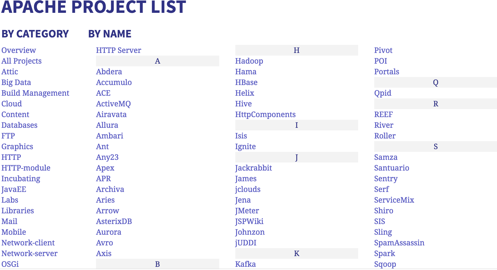

class: center, middle

# Apache

.height_8em[]

### Chris Wilson, AfNOG 2016

Based on a previous talk by Joel Jaeggli with thanks!

You can access this presentation at: http://afnog.github.io/sse/apache/
([edit](https://github.com/afnog/sse/apache/presentation.md))

---

## What is Apache?

* An HTTP server (web server)
* A foundation supporting several web-related software projects

.height_8em[]

For clarity it might help to talk about "Apache Server" to mean the HTTPD server.

.height_8em[]

---

## Other HTTP servers

What other HTTP (web) servers are commonly used?

---

## Other HTTP servers

What other HTTP (web) servers are commonly used?

???

Note: The "Other" category is 20%! This includes:

* Apache Tomcat
* Lighttpd
* Thttpd

Also note growing popularity of nginx.

---

## Which one to use?

* Apache: Popular, well-documented, flexible, secure, big, slow, heavy.
* Nginx: Increasingly popular, quite well-documented, very fast, reverse proxy, no PHP.
* Lighttpd: Simple, fast, no PHP.
* Thttpd: Tiny, fast, no PHP.

???

Notice how only Apache supports PHP (natively)?

Most web servers need you to install and run a FastCGI server to support PHP, which is more complex.

But it does completely isolate the PHP server process from your web server, preventing it from
bringing down your HTTP server (by overloading or a vulnerability).

---

## Apache Features

* Server Side Programming Language Support
  * Apache supports some common language interfaces which include Perl, Python, Tcl, and PHP. It also supports a variety of popular authentication modules like mod_auth, mod_access, mod_digest and many others.
* IPv6 Support
  * On systems where IPv6 is supported by the underlying Apache Portable Runtime library, Apache gets IPv6 listening sockets by default. 
* Virtual Hosting
  * Apache will allow one installation instance to serve multiple websites. For instance one Apache installation can serve sse.afnog.org, ws.afnog.org etc
* Simplified configuration (!)

More at: http://httpd.apache.org/docs/2.2/new_features_2_0.html 

---

## Stateful Firewalls

.fill[]

???

* "Stateful inspection" tracks the state or progress of a network connection.
* These are the states of a TCP connection.
* Most useful for allowing return packets for an open connection.
* Can prevent sneaking in packets after connection closed.
* What about ICMP and UDP? They are not inherently stateful protocols.
* Almost essential for NAT - tracks the internal address corresponding to a connection.
* Performance impact - scanning the connection table vs partially/not evaluating the ruleset

---

## Limitations of Firewalls

.fill[]

???

* Usually only block *inbound* traffic - what about outbound?
* How to protect against inside attacks? (more firewalls!)
* Limited ability to understand application protocols (need other defenses e.g. Application Layer Gateways)
* Performance impact - minimal (especially compared to ALGs)
* Blocking legitimate traffic
* Some traffic very hard to block (skype, encrypted bittorrent, particular websites)

---

## Blocking Websites

.fill[]

???

* How do you do it?
* How do you know what sites people are accessing?
* Can you do it at the packet level? DNS? HTTP Host header?
* Bypassing - alternative DNS servers, HTTPS
* Turkey blocking Twitter example
* How does China do it? Secret, massive manpower, intimidation.

---

## Typical features

* Rulesets (lists of rules, read in order)
* Rules (IF this THEN that)
* Match conditions
  * interface, IP address, protocol, port, time, contents
* Actions
  * accept, drop, reject, jump to another table, return
* Default policy

---

## iptables/netfilter

.fill[]

???

* `iptables` is the command-line tool to manage the Netfilter firewall
* connection tracking
* multiple "tables":
  * filter (packet filtering)
  * NAT
  * mangle
* hooks at different points in the packet path:
  * INPUT, FORWARD, OUTPUT, PREROUTING, POSTROUTING
* many matches and targets

---

## Listing current rules

We use the `iptables` command to interact with the firewall (in the kernel):

	$ sudo apt install iptables
	$ sudo iptables -L -nv

	Chain INPUT (policy ACCEPT 119 packets, 30860 bytes)
	 pkts bytes target     prot opt in     out     source       destination         

	Chain FORWARD (policy ACCEPT 0 packets, 0 bytes)
	 pkts bytes target     prot opt in     out     source       destination         

	Chain OUTPUT (policy ACCEPT 36 packets, 1980 bytes)
	 pkts bytes target     prot opt in     out     source       destination         

???

This command is to:

* `L`ist all the rules,
* in the `filter` table (default),
* not resolving `n`umeric addresses,

This shows 3 chains (INPUT, FORWARD and OUTPUT) with no rules in any of them.

---

## Your first ruleset

Configure your firewall to allow ICMP packets.

	$ sudo iptables -A INPUT -p icmp -j ACCEPT

	$ sudo iptables -L INPUT -nv

	Chain INPUT (policy ACCEPT 4 packets, 520 bytes)
	 pkts bytes target     prot opt in     out     source       destination         
	    0     0 ACCEPT     icmp --  *      *       0.0.0.0/0    0.0.0.0/0           

What effect will this have?

What are the numbers?

???

It will **-A**ppend a rule to the `INPUT` chain, which will match incoming packets.
It will have no effect for now, because the policy is also ACCEPT. However you will see
*icmp* packets accounted against the rule, instead of the chain.

The first two numbers show that 0 packets (totalling 0 bytes) have matched this rule
(since it was created or the packet counters were last reset).

---

## Testing rules

How can you test it?

	$ ping -c4 127.0.0.1
	PING 127.0.0.1 (127.0.0.1) 56(84) bytes of data.
	64 bytes from 127.0.0.1: icmp_seq=1 ttl=64 time=0.058 ms
	...

	$ sudo iptables -L INPUT -nv
	Chain INPUT (policy ACCEPT 220 packets, 218K bytes)
	 pkts bytes target     prot opt in     out     source       destination         
	    8   672 ACCEPT     icmp --  *      *       0.0.0.0/0    0.0.0.0/0           

Why do we see 8 packets against the rule, instead of 4?

You can use `iptables -L INPUT -nZ` to `Z`ero the counters.

???

* The *ping* command uses ICMP packets of the `echo-request` and `echo-response` types.
* Every ping has a request and a response packet.
* Both are received by the same machine because it's local.
* Try working with your neighbour: each test the other's firewall.

---

## Blocking pings

Add another rule:

	$ sudo iptables -A INPUT -p icmp -j DROP

	$ sudo iptables -L INPUT -nv
	Chain INPUT (policy ACCEPT 12 packets, 1560 bytes)
	 pkts bytes target     prot opt in     out     source       destination         
	    8   672 ACCEPT     icmp --  *      *       0.0.0.0/0    0.0.0.0/0           
	    0     0 DROP       icmp --  *      *       0.0.0.0/0    0.0.0.0/0           

	$ ping -c1 127.0.0.1
	64 bytes from 127.0.0.1: icmp_seq=1 ttl=64 time=0.067 ms

Is that what you expected?

???

Some people would have expected that pings would be dropped.

* Hint: look at the number of packets matching the DROP rule
* Why did no packets match? The ACCEPT rule came first!

---

## Rule precedence

Insert a DROP rule **before** the ACCEPT rule with `-I`:

	$ sudo iptables -I INPUT -p icmp -j DROP

	$ sudo iptables -L INPUT -nv
	Chain INPUT (policy ACCEPT 12 packets, 1560 bytes)
	 pkts bytes target     prot opt in     out     source       destination         
	    0     0 DROP       icmp --  *      *       0.0.0.0/0    0.0.0.0/0           
	   10   840 ACCEPT     icmp --  *      *       0.0.0.0/0    0.0.0.0/0           
	    0     0 DROP       icmp --  *      *       0.0.0.0/0    0.0.0.0/0           

---

## Rule precedence testing

	$ ping -c1 127.0.0.1
	PING 127.0.0.1 (127.0.0.1) 56(84) bytes of data.
	^C
	--- 127.0.0.1 ping statistics ---
	1 packets transmitted, 0 received, 100% packet loss, time 0ms

???

What can we do to tidy up?

---

## List rules with indexes

Use the iptables `-L --line-numbers` options:

	$ sudo iptables -L INPUT -nv --line-numbers
	Chain INPUT (policy ACCEPT 15 packets, 1315 bytes)
	num   pkts bytes target   prot opt in    out   source       destination         
	1        0     0 DROP     icmp --  *     *     0.0.0.0/0    0.0.0.0/0           
	2        0     0 ACCEPT   icmp --  *     *     0.0.0.0/0    0.0.0.0/0           
	3        0     0 DROP     icmp --  *     *     0.0.0.0/0    0.0.0.0/0

---

## Deleting Rules

Delete rule by index:

	$ sudo iptables -D INPUT 3

Delete rule by target:

	$ sudo iptables -D INPUT -p icmp -j ACCEPT

Check the results:

	$ sudo iptables -L INPUT -nv --line-numbers
	Chain INPUT (policy ACCEPT 9 packets, 835 bytes)
	num   pkts bytes target     prot opt in     out     source               destination         
	1        0     0 DROP       icmp --  *      *       0.0.0.0/0            0.0.0.0/0           

---

## Simple rule set

This is one of the first things I set up on any new box:

	iptables -P INPUT ACCEPT
	iptables -F INPUT
	iptables -A INPUT -m state --state ESTABLISHED -j ACCEPT
	iptables -A INPUT -i lo -j ACCEPT
	iptables -A INPUT -p icmp --icmp-type echo-request -j ACCEPT
	iptables -A INPUT -p tcp --dport 22 -j ACCEPT
	iptables -A INPUT -m limit --limit 5/min -j LOG --log-prefix 'Rejected INPUT '

Check that I can access the server without triggering a "Rejected INPUT" message in the logs, and then
lock it down:

	iptables -P INPUT DROP

---

## Persistent Rules

What happens when you reboot?

---

## Persistent Rules

What happens when you reboot?

The rules that we created are only in the kernel's memory. They will be lost on reboot.

How can we make them permanent? Could be as simple as:

	/sbin/iptables-save > /etc/default/iptables
	/sbin/iptables-restore < /etc/default/iptables

Or install `iptables-persistent` which automates this a little.

---

## Connection Tracking

Every packet is tracked by default (made into a connection).

You can see them with `conntrack -L`:

	sudo /usr/sbin/conntrack -L
	tcp      6 431999 ESTABLISHED src=196.200.216.99 dst=196.200.219.140 sport=58516 dport=22
	src=196.200.219.140 dst=196.200.216.99 sport=22 dport=58516 [ASSURED] mark=0 use=1

What does this mean?

---

## Connection Tracking

	sudo /usr/sbin/conntrack -L
	tcp      6 431999 ESTABLISHED src=196.200.216.99 dst=196.200.219.140 sport=58516 dport=22
	src=196.200.219.140 dst=196.200.216.99 sport=22 dport=58516 [ASSURED] mark=0 use=1

* ESTABLISHED is the connection state
  * What are valid states?
* src=196.200.216.99 is the source address of the tracked connection
* dst=196.200.219.140 is the destination address
  * Which one is the address of this host? Will it always be?
* sport=58516: source port
* dport=22: destination port
* Another set of addresses: what is this?

---

## Connection Tracking

How do we use it?

* `iptables -A INPUT -m state --state ESTABLISHED -j ACCEPT`
  * You normally want this!

Can you see any problems?

---

## Connection Tracking Problems

What happens if someone hits your server with this?

	sudo hping3 --faster --rand-source -p 22 196.200.219.140 --syn

Or if you run a server that has thousands of clients?

---

## Connection Tracking Problems

Add a rule to block all connection tracking to a particular port:

	sudo /sbin/iptables -t raw -A PREROUTING -p tcp --dport 22 -j NOTRACK

Write your rules so that connection tracking is **not needed** (allow traffic both ways).

You probably want to do this for your DNS server. How?

---

## Connection Tracking Problems

Add a rule to block all connection tracking to a particular port:

	sudo /sbin/iptables -t raw -A PREROUTING -p tcp --dport 22 -j NOTRACK

Write your rules so that connection tracking is **not needed** (allow traffic both ways).

You probably want to do this for your DNS server. How?

	sudo /sbin/iptables -t raw -A PREROUTING -p udp --dport 53 -j NOTRACK

---

## FIN

Any questions?

(yeah, right!)
