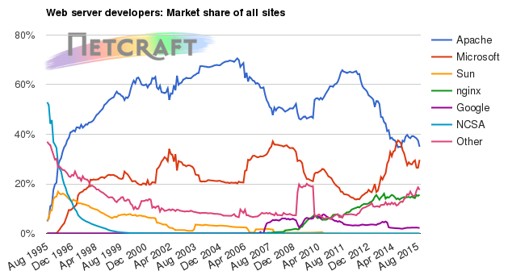
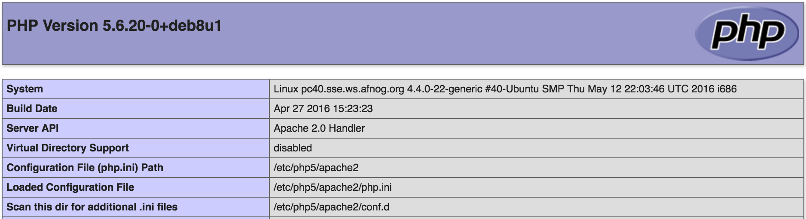

class: center, middle

# Apache

.height_8em[]

### Chris Wilson, AfNOG 2016

Based on a previous talk by Joel Jaeggli with thanks!

You can access this presentation at: http://afnog.github.io/sse/apache/
([edit](https://github.com/afnog/sse/apache/presentation.md))

.smaller.left[
* Online: http://afnog.github.io/sse/apache/
* Local: http://www.ws.afnog.org/afnog2016/sse/apache/index.html
* Github: https://github.com/afnog/sse/blob/master/sse/apache/presentation.md
* Download PDF: http://www.ws.afnog.org/afnog2016/sse/apache/presentation.pdf
]

---

## What is Apache?

* An HTTP server (web server)
* A foundation supporting several web-related software projects

.height_8em[]

For clarity it might help to talk about "Apache Server" to mean the HTTPD server.

.height_8em[]

---

## Other HTTP servers

What other HTTP (web) servers are commonly used?

---

## Other HTTP servers

What other HTTP (web) servers are commonly used?

.fill[]

???

Note: The "Other" category is 20%! This includes:

* Apache Tomcat
* Lighttpd
* Thttpd

Also note growing popularity of nginx.

---

## Which one to use?

* Apache
  * Popular, well-documented, flexible, secure, big, slow, heavy, PHP integration.
* Nginx
  * Increasingly popular, quite well-documented, very fast, reverse proxy, SSL support/wrapper, no PHP.
* Lighttpd
  * Simple, fast, no PHP.
* Thttpd
  * Tiny, fast, no PHP.

???

Notice how only Apache supports PHP (natively)?

Most web servers need you to install and run a FastCGI server to support PHP, which is more complex.

But it does completely isolate the PHP server process from your web server, preventing it from
bringing down your HTTP server (by overloading or a vulnerability).

---

## Apache Features

* Server Side Programming Language Support
  * Apache supports some common language interfaces which include Perl, Python, Tcl, and PHP. It also supports a variety of popular authentication modules like mod_auth, mod_access, mod_digest and many others.
* IPv6 Support
  * On systems where IPv6 is supported by the underlying Apache Portable Runtime library, Apache gets IPv6 listening sockets by default. 
* Virtual Hosting
  * Apache will allow one installation instance to serve multiple websites. For instance one Apache installation can serve sse.afnog.org, ws.afnog.org etc
* Simplified configuration (!)

More at: http://httpd.apache.org/docs/2.2/new_features_2_0.html 

---

## Virtual Hosting

What does it mean?

Apache support virtual hosting (deciding which website to display) using:

* Name based virtual hosts (`Host` header)
* IP/Port based virtual hosts
* Aliases (subdirectories)

???

**IP/Port based** virtual hosting looks at the IP and port that received the request to identify which
website to serve.

**Name based** virtual hosting is recommended for modern systems to conserve IP addresses. The server looks
at the IP and port **and also the Host: header of the request** to identify which website to serve. 

Every IP and port with `NameVirtualHost` enabled has a default site that is shown if the Host: header
does not match any site configured on the IP and port. This is useful for:

* showing a default page if the DNS has been changed to point a new domain to the web server,
  but the web server not yet configured for it;

* when you do not know which domain name the client is going to use, e.g. when intercepting 
  web requests (captive portal)

---

## PHP and MySQL

* Many web applications written in PHP and using a MySQL database.
* Relatively easy to deploy under Apache (and most web hosting).
* We will install the necessary software shortly.

---

## Apache and SSL

* SSL is the "Secure Socket Layer"
  * Used to secure several protocols including HTTP
  * When used properly, protects the wrapped protocol from 
  * Usually the wrapped protocol has little or no interaction with SSL layer (transparent)
  * This causes problems with virtual hosting!
* HTTPS (HTTP over SSL) runs on port 443 by convention
  * Each SSL-wrapped service runs on a different port than its non-SSL-wrapped version

---

## SSL Certificates

* Certificates identify parties (servers and sometimes clients)
  * SSL useless without server auth - why not?
* Need to generate a Certificate Signing Request (CSR) and get someone to sign it
  * Chain of trust, established by signatures
  * Signer needs to be trusted by web browser (directly or indirectly)
* Each SSL certificate* has a Public and Private key
  * The public key is used to encrypt the information
  * The public key is accessible to everyone
  * The private Key is used to decipher the information
  * The private should be not be disclosed to anyone

.footnote[.red.bold[*] The key is included on the certificate, but can be
reused on more certificates as long as not compromised. There is no way to
revoke it except to revoke all certs signed with it.]

---

## How SSL works

.fill[]

???

* Server gets a certificate:
  * Generates a public-private key pair
  * Generates a Certificate Signing Request (CSR) containing a hash of the public key
  * Sends CSR and money to a Certificate Authority (CA)
  * CA generates a certificate, including its own public key, signed with the corresponding private key, and returns to server
  * All of this happens ~1 time per certificate lifetime (1-5 years)
* Client connects to server via SSL
  * Sends a nonce (number used once) to server
  * Server signs nonce and returns it with the certificate (**which one?**) to client
* Client checks that:
  * It trusts the CA - possibly via a chain from a trusted CA
  * The cert lists the domain that it tried to connect to (**aha!**)
  * The cert has the correct purpose (authentication)
  * The cert has not been revoked (against a list downloaded by OCSP)
  * The nonce was signed by the key listed in the certificate
* All of this proves that:
  * The server has a key
  * which was given a certificate
  * which is valid for the purpose
  * and was signed (directly or indirectly) by a CA that the client trusts
  * and has not been revoked
  * therefore they can trust the server

Note: no protection against key theft except certificate revocation!

Also, invalidating a certificate invalidates all those signed by it.

---

## Certificate Authorities

Who are these guys anyway?

* Geotrust, Go Daddy, RSA, Thawte, Verisign, many others...
* Trusted by browsers
* Verify your identity (not really any more)
* Take your money
* Try not to lose their private keys
  * What would happen if they did?

---

## Self-signed certificates

* Useful for testing
* Useful in controlled environments
* Free (as in beer, but take time and skill to manage)
* Useless for clients who won't install the cert

---

## Getting Certificates

So how do I get one again?

* Pay money
* Self-certified (own CA)
* Self-signed

We will use a self-signed certificate in order to proceed quickly. There are tutorials on the
Internet on running your own CA with OpenSSL (it's not that hard, really).

---

## Install Apache

	sudo apt install apache2

How do you test that it worked?

---

## Install Apache

	sudo apt install apache2

How do you test that it worked?

	telnet localhost 80

And visit http://pcXX.sse.ws.afnog.org in your browser.

What content is it serving? How do we change it?

---

## Enable and test IPv6

Set your IPv6 address to match your IPv4 address (replace `XX` with your PC number plus 100):

	$ sudo ip -6 addr add 2001:43f8:220:219::XX/64 dev eth0

Then add your default route for IPv6:

	$ sudo ip -6 route add default via 2001:43f8:220:219::1

On the above if you get the error message `RTNETLINK answers: File exists`, it means that
the gateway is already in place, as it was auto-configured.

Test your IPv6 connectivity:

	$ ping6 www.google.com

Then browse your IPv6 address at http://[2001:43f8:220:219::XX] (the square brackets
are deliberate and essential!).

---
class: pre-compact

## Apache configuration files

	* /etc
	  * /apache2
	    * apache2.conf
	    * ports.conf
	    * conf-available
	      * *.conf
	    * conf-enabled
	      * symlinks to mods-available for services which are enabled
	    * mods-available (and mods-enabled)
	      * *.load
	      * *.conf
	    * sites-available (and sites-enabled)
	      * 000-default.conf
	      * default-ssl.conf
	* /var/www/html (content)
	  * index.html (the test page)

Why this structure?

---

## Enabled sites and modules

* `mods-available` and `sites-available` allows packages to ship default configuration files
  * **without** them being enabled automatically
  * more secure than Red Hat/CentOS system
* Enable and disable with commands:
  * `a2enmod` and `a2dismod`: modules (mods)
  * `a2ensite` and `a2dissite`: sites
  * `a2enconf` and `a2disconf`: configuration files (confs)

Which sites, modules and confs are enabled by default, and which are not?

---

## Starting Apache

* Startup scripts are located in `/etc/init.d/`
  * `/etc/init.d/apache2 start`
  * `service apache2 start`
* Other useful commands:
  * `/etc/init.d/apache2 stop`
  * `/etc/init.d/apache2 restart` (stop+start)
  * `/etc/init.d/apache2 reload` (graceful reload config)

---

## Install MySQL and PHP

Install the packages:

	$ sudo apt install mysql-server apache2 php5 php5-mysql
	
When the mysql-server prompts for a password to be entered use 'afnog' as the
password. If not prompted, don't worry, we will set it later.

---

## Testing PHP

Create the file `/var/www/html/test.php` with the following contents:

	<?php echo phpinfo(); ?>

Load it in your browser at <http://pcXX.sse.ws.afnog.org/test.php>. You should see this:

.height_12em[]

---
class: pre-compact

## Securing MySQL

Please read the instructions and use the letters "y" or “n” on the keyboard.

	$ sudo mysql_secure_installation

The password for MySQL is probably `afnog` (unless you entered a different password
during the installation above).

	Enter current password for root (enter for none): 
	OK, successfully used password, moving on...

	Remove anonymous users? [Y/n] y                                            
	 ... Success!

	Disallow root login remotely? [Y/n] n
	... Success!

	Remove test database and access to it? [Y/n] y

	Reload privilege tables now? [Y/n] y
	 ... Success!

	Cleaning up...

---

## Testing MySQL

Log in to mysql console to check if the password was set properly using command below.

	$ mysql -u root -p
	Password:

Type the password at the prompt. Then you should see a `mysql>` prompt, which means that
you authenticated successfully and can enter SQL commands.

You can exit from the `mysql>` prompt by typing the command `exit`.

---

## Configuring SSL

To create a secure virtual host accessed via https rather than http, you will
need to configure your Apache server to use OpenSSL for encrypting the data
served from the web server.

NOTE:

* Each virtual host must have its own certificate file see comments on "CommonName".
* The "CommonName" is the FQDN in this case pcXX.sse.ws.afnog.org  
* The path is where the certificate File and Keys are located, in this case `/etc/apache2/ssl`.
 
---

## Configuring SSL

### Create your public and private key

Generate a public and private key-pair:

	$ sudo mkdir /etc/apache2/ssl/
	$ cd /etc/apache2/ssl/
	$ sudo openssl genrsa -des3 -out server.key 2048 

NOTE: A passphrase will be requested to encrypt the key. For this exercise, use
"afnog" as the pass phrase. However, this pass-phrase will be needed at every
apache restart. To get rid of the passphrase prompts at every apache restart
and maintain the original key, run these commands:

	$ sudo cp server.key server.key.orig
	$ sudo openssl rsa -in server.key.orig -out server.key

---

## Configuring SSL

### Create a Certificate Signing Request (CSR)

Use this command to generate a new Certificate Signing Request (CSR):

	$ sudo openssl req -new -key server.key -out server.csr

This will prompt for some information. Most doesn't matter, but the CommonName
is the name of the Website you will use to access the Apache server. In this case
you will access your PC using its hostname, i.e. `pcXX.sse.ws.afnog.org`, where
XX is your computer number.

---

## Configuring SSL

### Self-sign your own certificate

Use this command to sign the certificate with the same public key (a
self-signed certificate):

	$ sudo openssl x509 -req -days 365 -in server.csr -signkey server.key -out server.crt

---

## Enable SSL in Apache

We need to tell Apache where to find the certificate and the private key files
that we want it to use. 

* Edit `/etc/apache2/sites-available/default-ssl.conf`
* Find and modify the `SSLCertificateFile` and `SSLCertificateKeyFile` lines to read:

	SSLCertificateFile    /etc/apache2/ssl/server.crt
	SSLCertificateKeyFile /etc/apache2/ssl/server.key

* Enable the SSL module and the default SSL site:

	sudo a2enmod ssl
	sudo a2ensite default-ssl
	sudo service apache2 reload

---

## Testing SSL

Open <https://pcXX.sse.ws.afnog.org> in your browser. What do you see?

.fill[]

You may need to click on *Advanced* and then *Proceed to pcXX.sse.ws.afnog.org (unsafe)*
(or something like that) to get to the site.

---

## Testing SSL

.fill[]

Success! (kind of)

---

## Testing SSL

What about the red padlock? Click on it, and then *Details* and *View Certificate* (or similar):

.height_18em.center[]

---

## Solving the security warning

* Submit the (same) CSR to a well-known CA, or
* Install the cert in your browser's certificate store:

.height_18em.center[]

---

## FIN

Any questions?

(yeah, right!)
