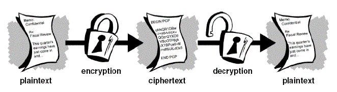
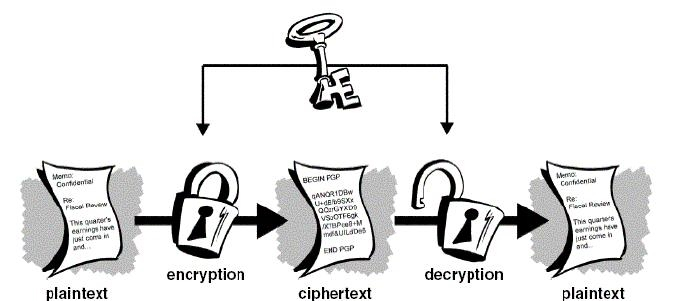
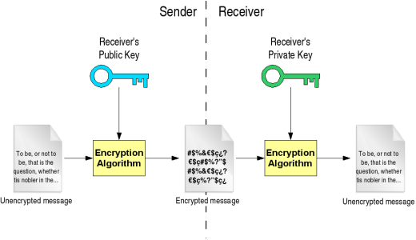
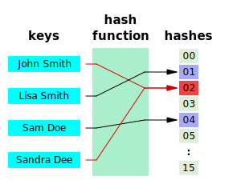

class: center, middle, title

# Cryptography and Security

## How to keep your data safe (a bit)

.height_8em[]

### Chris Wilson, [Aptivate](http://www.aptivate.org/), AfNOG 2014

---

## Credits

Based on presentations by:

* [Marcus Adomey](http://www.afnog.org/afnog_chix2011/Thursday/MA/CryptographySlides.odp) (AfChix, Malawi, 2011)
* [NSRC](https://nsrc.org/workshops/2013/nsrc-tenet-tut/raw-attachment/wiki/AgendaTrack2) (NSRC-TENET Workshop, South Africa, 2013)

You can access this presentation at: http://afnog.github.io/sse/crypto/presentation

Download or edit this presentation [on GitHub](https://github.com/afnog/sse/crypto/presentation.md).

---

## Conventions

Commands to enter are shown like this:

```sh
openssl smime -encrypt -binary -aes-256-cbc -in message3.txt -out message3.txt.enc yourpartner.crt.pem
openssl smime -decrypt -binary -in encrypted.zip.enc -out decrypted.zip -inkey private.key -passin pass:your_password
```

Please note:

* Long command lines are wrapped for readability.
* Each &#9656; triangle marks the start of a single command.

---

## What we can talk about

* What is security? (theory)
* What is cryptography? (theory)
* Public and private key crypto
* Hash functions
* Generating SSL certificates
* .red[Running a mini Certificate Authority] (todo)
* Practical exercises

---

## What do you care about?

What is security?

--

* Trying to prevent some particular event.

What do you want to prevent? What is the **threat**?

--

* Is your data valuable to someone else?
* Are your systems valuable to someone else?
* Can someone cause expensive damage (e.g. death)?
* What prevents them from doing that?

???

* Is your data valuable to someone else?
  * Sell it?
  * Blackmail?
  * Steal money or resources?
  * Embarrass somebody important?
  * Threaten to or actually cause downtime?
* Are your systems valuable to someone else?
  * CPU time?
  * Disk space?
  * Network bandwidth?
  * IP addresses?
  * Access to other systems?
* What prevents them from doing that? - brainstorm

---

## Examples of security measures

Make a list of measures that you actually use.

--

For example:

* Locks on doors
* Security lights
* Video cameras
* Passwords
* Dual signatures
* Thumb prints
* Credit card PIN
* Credit limits

---

## How secure are you?

How would you crack the defensive measures that we just listed?

---

## Absolute security

> The only truly secure system is one that is powered off, cast in a block of concrete and sealed in a lead-lined room with armed guards - and even then I have my doubts. - [Gene Spafford](http://spaf.cerias.purdue.edu/quotes.html)

Security is **impossible** if:

* some users have additional rights (privileges)
* AND you cannot distinguish users using only laws of physics
* OR you cannot make it physically impossible to violate policy

---

## Living with insecurity

* **Can't** be completely secure
* **Can** make individual attacks:
  * More expensive
  * More risky
  * Less rewarding
* Beware the side effects (systems harder to use)
* Increase transparency
  * more eyes on attackers
  * more understanding of what security means

---

## Reducing specific risks

* Use encrypted communications
* Use multi-factor authentication
* Verify authenticity of messages
* Reduce risks (don't keep sensitive data)
* Increase risks for attackers (monitoring and logging)

---

## Goals of system security

Why do you lock your doors?

* Confidentiality
* Integrity
* Authentication
  * Access Control
  * Verification
  * Non-repudiation
* Availability

---

## Confidentiality (secrecy)

--

* Ensuring that no one can read the message except the intended receiver.
* Data is kept secret from those without the proper credentials, even if that data travels through an insecure medium.
* How does this prevent 

---

## Integrity (anti-tampering)

--

* Assuring the receiver that the received message has not been altered in any way from the original.
* Preventing unauthorised or undetected changes to the protected system.

---

## Authentication

--

* The process of proving one's identity.
  * The primary forms of host-to-host authentication on the Internet today are name-based or address-based, both of which are notoriously weak.
* Cryptography can help establish identity for authentication purposes (how?)

--

  * Can prove that you possess a secret
  * Or that you spent a LOT of energy to brute-force it

---

## Non-repudiation

--

* A mechanism to prove that the sender really sent this message

---

## How do we use cryptography?

--

* ssh/scp/sftp
* SSL/TLS/https
* pops/imaps/smtps
* VPNs
* dnssec
* wep/wpa
* digital signatures (software)
* certificates and pki
* DRM
* disk encryption

---

## Applied Cryptography


Written by Bruce Schneier. Perhaps the best book around if you
want to understand how cryptography works.

https://www.schneier.com/book-applied.html

---

class: small

## Cryptographic Tools

* hashes/message digests
  * MD5, SHA1, SHA256, SHA512
  * collisions
* entropy (randomness)
* keys
  * symmetric/asymmetric (public/private)
  * length
  * creation
  * distribution
* ciphers
  * block/stream
  * AES, 3DES, Blowfish, IDEA
* plaintext/ciphertext
* password/passphrase

---

## Ciphers &rarr; Ciphertext



The foundation of all of cryptography:

* We start with *plaintext*. Something you can read.
* We apply a mathematical algorithm (*cipher*) to it.
* The plaintext is turned in to *ciphertext*.
* Almost all ciphers were secret until recently.
* Creating a secure cipher is HARD.

---

## Symmetric Ciphers (Conventional)

.center.height_8em[]

**The same key** is used to encrypt the document before
sending and to decrypt it once it is received.

* Lost key = compromised/lost data
* This type of cipher system is efficient for large amounts of data
* Most are relatively simple to understand and implement

---

## Common Symmetric Ciphers

* DES (56 bits, 1977)
* 3DES (112 bits, 1998)
* AES (128-256 bits, 2001)
* IDEA (128 bit, 1991, patented until 2012)

---

## Problems with Conventional Cryptography

### Key Management

* How to get the same key to all users without risk of compromise?
* This is why "Public Key Cryptography" became popular.

---

## Public Key Cryptography

**Different related keys** are used to encrypt the document before
sending and to decrypt it once it is received.

* Usually one key is public and the other private
  * Anyone &rarr; private key holder (confidentiality)
  * Private key holder &rarr; anyone (integrity)
* Examples: RSA, DSA

.center.height_8em[]

---

## Problems with Public Key Crypto

* Inefficient for large amounts of data
* Possible to brute-force the private key for a public key
* Theoretically possible to convert a public key back to private

Solutions?

--

* Use public key crypto to encrypt the secret used to encrypt document
* Longer keys are harder to brute-force (e.g. 2048 bits, 4096 bits)
  * Notice how long these are compared to symmetric cipher keys!
* Use a well-designed (unbroken) algorithm

---

## Hash Functions

Algorithms that take any amount of input and return a fixed-size output string,
which is called the hash value or **hash**.



---

## Ideal hash function

Has these properties:

* easy to compute the hash value for any given message
* infeasible to find a message that has a given hash
* infeasible to modify a message without changing its hash
* infeasible to find two different messages with the same hash

What does *infeasible* mean?

---

## Perfect hash function

A hash function that maps each valid input to a different hash value is said
to be *perfect*.

* What does that mean?
* How realistic is that?

---

## Practicals

---
layout: true
## Hash Practical 1
---

### Exercise

Using this hash function:

* Add up all the letters and digits in the message (A=1, B=2, etc)

Perform the following exercise:

* Write a short message to a partner
* Compute the hash **on a separate paper**
  * Avoid giving away your working to make it harder
* Give the message and hash to your partner to verify
* Verify the message from your partner

---

### Analysis

Does this hash function meet our ideal properties?

1. easy to compute the hash value for any given message
2. infeasible to find a message that has a given hash
3. infeasible to modify a message without changing its hash
4. infeasible to find two different messages with the same hash

---

### Analysis

Not really!

1. Easy to compute.
2. Easy to find another message with the same hash (string of 1s)
3. Easy to modify a message without changing its hash (rearrange the letters)

---

layout: false
## Hashes in real life

[ftp://ftp.freebsd.org/pub/FreeBSD/releases/i386/i386/ISO-IMAGES/10.0/](ftp://ftp.freebsd.org/pub/FreeBSD/releases/i386/i386/ISO-IMAGES/10.0/)

* Look at the `CHECKSUM.MD5` and `CHECKSUM.SHA256` files.
* What do they tell you?
--

The checksums of the large binary files in that directory.

* Do you actually need to download this file from `ftp.freebsd.org`?
* How would you check that your download is complete and not corrupt?
* How long are the hashes? How secure are they?

---

## Hash Practical 1

### Verifying downloads

```sh
fetch http://mini1.sse.ws.afnog.org/~inst/FreeBSD-10.0-RELEASE-i386-bootonly.iso
md5 FreeBSD-10.0-RELEASE-i386-bootonly.iso
sha256 FreeBSD-10.0-RELEASE-i386-bootonly.iso
```

* Does it match?
* Why would you do this?
* What speed did you get?

---
layout: true
## Hash Practical 2
---

### Hashing your own message

* Write a message to your partner in a text file (e.g. `message1.txt`)
* Use the `sha256` command to generate a signature for the file.
* Use `scp` to copy the file to your partner's computer:

```sh
scp message1.txt afnog@pcYY.sse.ws.afnog.org:/tmp
```

---

### Verifying the Hash

* You will find your partner's message in the `/tmp` directory.
* Tell your partner the first four letters of the hash.
* Check the hash of your partner's message.
* Make a small change to the message. How does the hash change?

---
layout: true
## Encryption Practical 1
---

### Basic Encryption

* Write a message to your partner in a text file (e.g. `message2.txt`)
* Choose your encryption passphrase to share with your partner
* Encrypt your message with `openssl`:

```sh
openssl aes-256-cbc -a -salt -in message2.txt -out message2.txt.enc
```

---

### Basic Decryption

* Have a look at the output file (`message2.txt.enc`)
* Send the file to your partner
* Decrypt the message from your partner:

```sh
openssl aes-256-cbc -d -a -in message2.txt.enc -out message2.txt.new
```

???

Credit: http://tombuntu.com/index.php/2007/12/12/simple-file-encryption-with-openssl/

---

### Questions

* Was the previous exercise using symmetric or asymmetric crypto? How do you know?
* Using public key crypto?
* What algorithm did we use?

---
layout: true
## Encryption Practical 2
---

### Certificate Generation

* If you don't already have a certificate, you need one.
* We can make self-signed certificates for free:

```sh
openssl req -x509 -new -out yourname.crt.pem -keyout yourname.key.pem
```

Questions:

* What are the output files?
* How long is the key?
* What is the passphrase for?

---

### Certificate Exchange

* Send the certificate (NOT the key) to your partner.
* Examine the certificate sent by your partner:

```sh
openssl x509 -in yourpartner.crt.pem -noout -text
```

Questions:

* How do you know that you're looking at the correct certificate?
* What can you do with this certificate?
* Why do we **not** send the key file to our partner?

---

### Encryption

* Write a message to your partner in a text file (e.g. `message3.txt`)
* Encrypt your message with `openssl`:

```sh
openssl smime -encrypt -binary -aes-256-cbc -in message3.txt -out message3.txt.enc yourpartner.crt.pem
```

Questions:

* Why do we use our partner's certificate, not our own?
* What can you do with this file?
* Who can read the file?

???

Credit: http://stackoverflow.com/a/12233688/648162

---

### Decryption

* Have a look at the output file (`message2.txt.enc`)
* Send the file to your partner
* Decrypt the message from your partner:

```sh
openssl smime -decrypt -binary -in message3.txt.enc -out message3.txt.dec -inkey yourname.key.pem
```

Questions:

* Why do you need to enter your passphrase?

---

### Questions

* How could an attacker break this encryption?
* How much would it cost?
* How do we verify the authenticity of the message?
* Where are the weak points in this process?

---

### Weaknesses

* Certificate exchange
* Passphrase memory
* Passphrase entry
* Decrypted file stored on disk
* Brute force attack on passphrase
* Brute force attack on key

---
layout: false
## Passwords

.center[[](http://xkcd.com/936/)]

---
layout: true
## Secure Shell
---

### Host Keys

Why do we verify host keys?

--

.height_8em.center[]

* Avoid giving your password to an attacker (why?)
* Avoid leaking information to an attacker (how and why?)

---

### Host Key Demonstration

When you SSH to your partner's computer for the first time, what do you see?

--

> The authenticity of host 'pc34.sse.ws.afnog.org (196.200.219.134)' can't be established.
> ECDSA key fingerprint is ae:09:ce:83:09:fc:d5:ca:69:ae:df:7d:c6:92:1e:e5.
> Are you sure you want to continue connecting (yes/no)? 

What should you do about it?

```sh
ssh-keygen -lf /etc/ssh/ssh_host_ecdsa_key.pub
```

---

### Key Caching

What happens after the first time you connect? Why?

--

* If you answer **Yes**, the host key is cached in `~/.ssh/known_hosts`.
* No message is displayed if the key has not changed.

---

### Attack Demonstration

To see what happens, replace your host key:

```sh
sudo /etc/rc.d/sshd keygen
```

* Wait until your partner has replaced their host key
* Try connecting to their virtual machine
* What happens?

---

```
@@@@@@@@@@@@@@@@@@@@@@@@@@@@@@@@@@@@@@@@@@@@@@@@@@@@@@@@@@@
@    WARNING: REMOTE HOST IDENTIFICATION HAS CHANGED!     @
@@@@@@@@@@@@@@@@@@@@@@@@@@@@@@@@@@@@@@@@@@@@@@@@@@@@@@@@@@@
IT IS POSSIBLE THAT SOMEONE IS DOING SOMETHING NASTY!
Someone could be eavesdropping on you right now (man-in-the-middle attack)!
It is also possible that a host key has just been changed.
The fingerprint for the ECDSA key sent by the remote host is
ae:09:ce:83:09:fc:d5:ca:69:ae:df:7d:c6:92:1e:e5.
Please contact your system administrator.
Add correct host key in /home/chris/.ssh/known_hosts to get rid of this message.
Offending ECDSA key in /home/chris/.ssh/known_hosts:228
  remove with: ssh-keygen -f "/home/chris/.ssh/known_hosts" -R pc34.sse.ws.afnog.org
ECDSA host key for pc34.sse.ws.afnog.org has changed and you have requested strict checking.
Host key verification failed.
```

---

### Implications

* When is this useful?
* When is it a problem?
* How would you fix it:
  * On the client?
  * On the server?

---

### Recovery

For now, fix it on your client by running:

```sh
ssh-keygen -R pcYY.sse.ws.afnog.org
```

And test that you can SSH without this warning.

* What do you see instead, and why?

---

### Key Authentication

* What is the biggest vulnerability in SSH?
* What can we do about it?

--

Passwords, and don't use them!

* or combine them with something else (what's that called?)

???

Two-factor authentication.

---

### Key Generation

If you don't already have an SSH key, generate one:

```sh
ssh-keygen
```

* Make sure you use a passphrase!
* **DO NOT** use `afnog` as the passphrase!

### Questions

* Why is a key with no passphrase dangerous?
* Why is a passphrase (on a key) better than a password (on an account)?
* What are the disadvantages?
* Why not use `afnog` as the passphrase?

---

### Answers

1. Unprotected key allows login to server with no password!
2. The passphrase is not sent to the server, only used to decrypt the key.
3. You need an agent to cache your passphrase and forward through servers.
4. So you can tell whether you're being asked for the password or the passphrase!

---

### Key Distribution

Copy the key to your partner's server:

```sh
ssh-copy-id -i ~/.ssh/id_rsa.pub pcYY.sse.ws.afnog.org
```

Now try logging in to their server. What's different?

```sh
ssh pcYY.sse.ws.afnog.org
```

--

You should be prompted for your passphrase instead of a password:

> Enter passphrase for key '/home/afnog/.ssh/id_rsa': 

---

layout: false

## FIN

Any questions?
