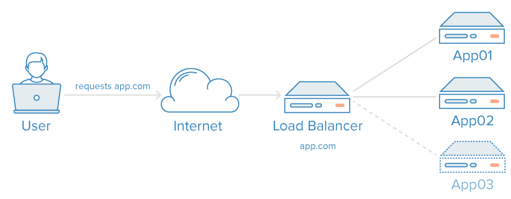

class: center, middle, inverse

# Deployment

.height_12em[]

### Chris Wilson, AfNOG 2016

---

## About this presentation

Based on previous talks by Joel Jaeggli, Evelyn Namara and NSRC, with thanks!

You can access this presentation at:

* Online: http://afnog.github.io/sse/apache/
* Local: http://www.ws.afnog.org/afnog2016/sse/apache/index.html
* Github: https://github.com/afnog/sse/blob/master/apache/presentation.md
* Download PDF: http://www.ws.afnog.org/afnog2016/sse/apache/presentation.pdf

Acknowledgements:

* Cover photo by [MarianZubak at en.wikipedia, CC BY 2.5](https://commons.wikimedia.org/w/index.php?curid=3402935)

---

## What is Deployment

Now you have this pretty shiny new thing!

* E.g. a web service, mail service, storage service

How do we make it:

* Reliable
* Scalable
* Secure
* Efficient (cheap)
* Fast

For heavy load (thousands of users?)

???

Right?

---

## What is Deployment

* Wrong time to ask!
* Needs to have been designed for all this (architecture)
* Better hope the designers thought of it!

---

## Design for Deployment

So how do we **design** something:

* Reliable
* Scalable
* Secure
* Efficient (cheap)
* Fast

---

## Design for Deployment

Two ways: scale UP (bigger boxes) or scale OUT.

* Scale UP is appropriate when:
  * size is limited (e.g. internal service for <1000 users) and 
  * reliability is not critical (<99% uptime) so you can restore from backups
* Otherwise you must scale OUT

---

## Scaling UP

Scaling UP is boring:

* More expensive boxes and disks
* RAID arrays
* Large backups
* Slow restores
* Hard to move
* More complicated when service is layered (e.g. web app + database)
* Ultimately limited by how much (data/CPU) you can fit in 1-2 instances

---

## Scaling OUT

Build it out of smaller things (microservices) which are:

* Reliable
* Secure
* Small (cheap)
* Efficient (cheap)
* Fast

And connect them using an architecture which also is.

Note: the small things do not have to be scalable if your architecture scales!

.height_8em[]

---

## Organisation

What else is a large system organised out of smaller components?

---

## Organisation

.tall_float_right[]

What else is a large system organised out of smaller components?

WE ARE!

Note the hierarchical structure of complex organisms (see right)

---

## Characteristics of Life

RED GIRL:

* Respiration (energy use)
* Excretion (energy use)
* Death (plan for unit loss)
* Growth (possible but better avoided)
* Irritability (responds to events, I/O)
* Reproduction (create from saved image)
* Locomotion (migration)

---

## Microservices

Need to be/should be easy to:

* Maintain
* Monitor
* Manage
* Move

???

Why?

* Everyone needs software updates, sometimes major
* Need monitoring to Manage and to locate faults
* Management: do you really want to SSH into 100 boxes by hand?
* Move: everyone needs to move eventually, upgrade handling

---

## Microservices

Examples of microservices (microservers):

* File server
* Database server
* RADIUS server
* LDAP server
* HTTP reverse proxy/load balancer/SSL wrapper
* Static content HTTP server
* PHP/Python/Node.js server
* SMTP server
* IMAP server/load balancer
* DNS server

So how do we make these things?

???

You probably already know how. 

---

## Microservice outsourcing

Most of these you can buy as a service online:

* File server: not exactly, but Amazon S3/OpenStack Swift
* Database server: Amazon RDS, OpenStack Trove
* Authentication service: Amazon Directory Service (hosted AD), OpenID
* HTTP reverse proxy/load balancer/SSL wrapper: CloudFront
* Static content HTTP server: CDN (CloudFront etc)
* PHP server: most web hosts
* Ruby/Python/Node.js server: Engine Yard, Heroku
* SMTP server: MailChimp, Mandrill, SendGrid
* IMAP server/load balancer: not really
* DNS server: Dyn, Amazon Route 53, most web hosts

But if you want to build your own, read on...

---

## Microserver template

* Application/daemon
* Reliable
* Secure
* Small (cheap)
* Efficient (cheap)

Which application/daemon do we run, and how do we use it to achieve each of these requirements?

---

## File microserver

* Application/daemon: SMB server (Samba) or NFS or cluster FS
* Reliable -> replicated to another unit (DRBD or cluster FS)
* Secure:
  * Against **all kinds** of unauthorised access?
  * Network encryption
  * Authenticate against RADIUS/LDAP/Kerberos
* Small (cheap) -> 20-100GB size?
  * Forces us to break up our large storage requirements
* Efficient (cheap):
  * SMB and NFS are both lightweight
  * Network and disk encryption are costs - do we need them?

---

## SQL database microserver

* Application/daemon: MySQL or PostgreSQL
* Reliable -> database replication
* Secure:
  * Built-in authentication and authorisation
  * .red[No external authentication?]
* Small (cheap) -> 20GB size?
  * Forces us to break up our large database requirements (AKA sharding)
  * Design for isolation where possible, e.g. one DB per customer
  * Per-customer DBs are too small, so combine multiple DBs per server with migration plan
* Efficient (cheap):
  * SQL database servers are heavyweight!
  * Only master servers are writable!
  * Queries are expensive, so run them on read-only slaves

---

## HTTP microserver

* Application/daemon: Nginx
* Reliable -> stateless
* Secure:
  * Nginx is small (but had many vulnerabilities)
* Small (cheap) -> Nginx is lightweight
* Efficient (cheap) -> Nginx is lightweight

---

## Routing

How to connect up these services:

* How do people access them (front end)
* How do they locate/find each other?
  * How does webserver B know which database/IMAP server to use for this customer?

---

.left-column[
## Routing
]

.right-column[
This is how we actually **build** a service out of simple components (**architecture**):

.height_8em[]

* Applies at every level: front end->web server, web server->database/IMAP, IMAP->file server
* DNS, load balancer or application logic
* What happens if the user's host instance is down?
  * Need an automated fault detection and failover system!
  * Probably need to engineer this yourself
* Ignore the problem and hard-code it like we always did before
]

---

.left-column[
## Routing
### DNS
]

.right-column[
Use the DNS to send clients (users or applications) to an instance:

* Direct: john.provider.com
  * Just add A records to DNS
  * Beware: DNS cannot be changed instantly (failover is slow)
* Indirect: login first and redirect to instance
  * Requires server-side application logic/support
* Potential many-to-one: john.provider.com and steve.provider.com -> same web/DB server
  * Can be changed transparently to user and without downtime
  * Note: migration (planned) is easy, failover (unplanned) is hard
]

---

.left-column[
## Routing
### DNS
### Load balancer
]

.right-column[
Place a load balancer in front of servers, and direct clients to it.

Advantages:

* Transparent to users
* Instant failover (unlike DNS)
* You may need a reverse proxy anyway (for SSL, static content routing)
* Typically good routing flexibility (reason for existence!)

Disadvantages:

* Single point of failure
* Can interfere with application
  * HTTP Host header, cookie, redirect rewriting
  * Application state: need stateful routing?
* Another layer adds complexity and latency
]

---

.left-column[
## Routing
### DNS
### Load balancer
### Application logic
]

.right-column[
Application designed (or modified) to choose which backend to use based on an algorithm.

* Lookup which database to use... in the database?
* Doesn't work for the user frontend!
* Could be based on username:
  * john -> server j.sql.provider.com
  * steve -> server s.sql.provider.com
  * Or first 2 letters, etc.
* Using DNS for indirection makes migration easier

In some cases, only app logic is needed, e.g. store files in Amazon S3 and let
Amazon handle load balancing and HA.
]

---

## Routing, Monitoring and Failover

* Nagios monitors your web/DB/IMAP backend servers
* Failure detected -> run event handler (Nagios feature)
* Handler initiates failover:
  * Change the DNS
  * Reconfigure load balancers
  * Rewrite application config files and restart
  * Update database -> web application responds
  * Start a VRRP IP failover/takeover
  * New master may need reconfiguration (e.g. read-only slave -> read-write master DB)
  * Assume fail-hard: consistency check may be required

---

## Routing, Monitoring and Failover
### Recovery handling

* Recovery detected -> run a different event handler
  * What should it do?
  * Fail back immediately?
  * Reconfigure recovered instance as a slave?
  * Recovery is often harder than failover!

---
class: center, middle, inverse

## FIN

Any questions?

(yeah, right!)
