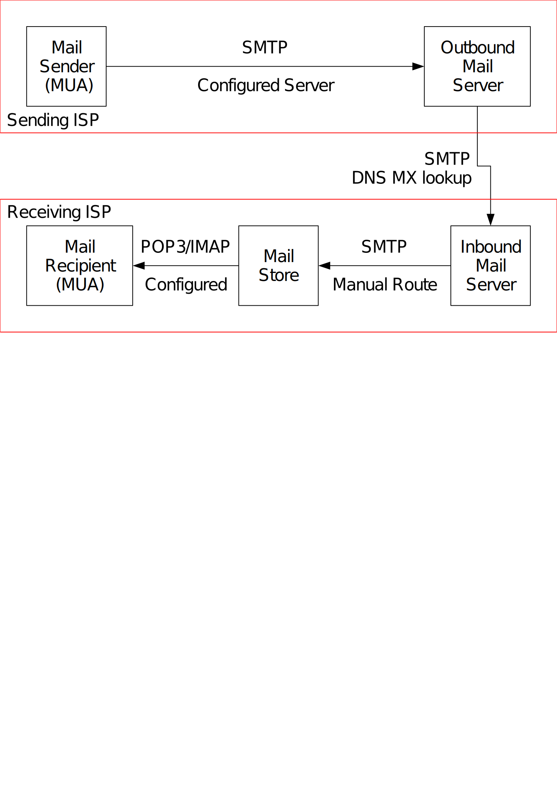

class: center, middle

# Exim and Internet Mail

## Chris Wilson, [Aptivate](http://www.aptivate.org/), AfNOG 2013

Download or edit this presentation [on GitHub](https://github.com/afnog/sse/exim/presentation.md).

---

## Agenda

1. How email works
2. Setting up a mail server
3. Customising your server

---

## How email works

---

## What is Exim?

* Listens on port 25 (smtp)
* Accepts mail
* Queues mail
* Delivers it somewhere
	* Using SMTP, LMTP, LDA, mbox or maildir
* No POP, IMAP, calendars, to-do lists, Crackberry!

---

## Who uses Exim?

???

About 23% of the servers polled by the [Open Email Survey](http://www.openemailsurvey.org/smtp.html).
2nd most popular SMTP server after Postfix.

---

## Why use Exim?

* Flexible (lots of features)
* Reasonably secure
* Reasonably scalable
* Good debugging options
* Sane (but complex) configuration syntax

---

## Why not to use Exim

Not every problem is a nail:

* **Simplicity?** Use postfix or qmail
* **Security?** Use qmail
* **Speed?** Use postfix or sendmail
* **Insanity?** Use sendmail or qmail

Note: Exim is not designed for spooling large amounts of mail. Its queue
handling slows down with large queues (thousands of messages queued).

---

## Conventions

As used in this presentation:

* File names and technical terms are in *italics*.
* Commands to type are shown thus:

	cat /etc/monospaced/bold/italic/purple

Long command lines may be wrapped, with lines between each line:

	cat /usr/local/etc/foo/bar | less | more | grep | sed | awk > /usr/local/tmp/foo/bar
	sudo make SUBDIR=old WITH_RADIUS_TYPE=RADLIB EXTRALIBS_EXIM=/usr/lib/libradius.so install clean

Text that is output by a program, or should already be in a file, is shown in plain monospaced type:
sshd_enable="YES"

