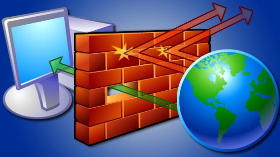

class: center, middle

# Linux Firewalls

.height_8em[]

### Chris Wilson, AfNOG 2015

Based on a previous talk by Kevin Chege with thanks!

You can access this presentation at: http://afnog.github.io/sse/firewalls/
([edit](https://github.com/afnog/sse/firewalls/presentation.md))

---

## What is a Firewall?

.height_8em[]
.height_8em[]
.height_8em[]
.height_8em[]
.height_8em[]

???

* Computer network security device
* Decided whether packets are allowed or denied
* Uses a pre-defined set of rules

Many devices have built-in firewalls:

* End devices (desktop, laptop and server)
* Routers
* IP-connected devices
* Dedicated hardware

Questions:

* Ask for some examples in each category
* Software and hardware firewalls
* Any unusual examples? Mobile phones, desk phones, toasters?

---

## Advanced Firewalls

* Basic firewalls are packet filters
* Can't always make a decision based on one packet (examples?)
* Stateful firewalls (connection table)
* Application layer (L7) filtering/inspection/IDS
* Redundant firewalls with synchronisation
* VPNs and SSL "VPNs"

???

Decisions that can't be made based on one packet:

* Downloading a forbidden file type
* Downloading a virus
* Sending emails with a virus
* Established connections/Reply packets (information smuggling)
* P2P traffic (bittorrent, skype, etc)

---

## Stateful Firewalls

.center[]

???

* "Stateful inspection" tracks the state or progress of a network connection.
* These are the states of a TCP connection.
* Most useful for allowing return packets for an open connection.
* Can prevent sneaking in packets after connection closed.
* What about ICMP and UDP? They are not inherently stateful protocols.
* Almost essential for NAT - tracks the internal address corresponding to a connection.

---

## Participants

Get to know each other!

* Name
* Country
* Work
* Favourite superhero

Close your laptops :)

???

If you're running a workshop, try this game:

* Works best if there's an even number of people on each table.
* Divide the group into pairs.
* Ask the group to put their hands up if they're paired with someone they
already know.
* "If your hand is up and you're left of the person you know, stand up and
  move to the front."
* "Now sit down next to someone you don't know."
* Repeat to check that everyone's paired with someone they don't know.
* Each pair has 2 minutes to get to know the person next to them. Should make notes.
* Then they have to introduce the other person in their pair.

---

## Presentations

* Theory followed by practical exercises
* Help us to help you!
* Complaints box
* Please set phones to silent
* Please close your laptops during theory sessions

???

Please tell us if you don't understand. You're not the only one.

Please don't distract others - tell us if you're bored!

Suggestion: if someone's phone rings, they have to do a dance for us :)

---

## Timetable

* 06:30-08:00: Breakfast at the hotel (Kempinski)
* 07:45, 08:00, 08:15 and 08:30: Buses to the venue (Palace du Peuple)
* 09:00: Workshops start
* 11:00: tea break
* 14:00-15:00: lunch at the venue (Palace du Peuple)
* 16:30: tea break
* 18:30: dinner at the venue (Palace du Peuple)
* 19:30, 19:45, 20:00 and 20:15: buses to hotel (Kempinski)

Updates on the [NSRC wiki](https://nsrc.org/workshops/2014/afnog/wiki/Timetable).

---

## Meals

* Breakfast at the hotel (Kempinski): 06:30-08:00
* Lunch at the Palace du Peuple: 14:00-15:00
* Dinner at the Palace du Peuple: 18:30-20:30

Please be back in class on time from breaks!

---

## Extra Charges

AfNOG will not pay for any extra charges on your hotel room, such as:

* phone calls
* food and drinks (including room service)
* laundry

Beware the hotel prices!

---

## Inventory

You should have received:

* Name badges
* Folder with notepad, pen, information pack

Take your name badge to meals at the Palace du Peuple!

---

## Gifts

At the end you will receive:

* A USB stick with some O'Reilly eBooks
* Possibly a FreeBSD CD-ROM

Please share with your colleagues back at home.

## Community

What did Sunday said about community?

???

* Who will you share your knowledge with?
* How can you continue to learn and improve your skills after the event?

Build a local community, be active, organise an event and invite people!

Make a plan, share the work, think about what you have to give and what you
can gain by sharing. Who is married here? Why did you get married? Is it
worth it?

---

## Electronic Resources

Web site: http://www.ws.afnog.org/afnog2014/

AfNOG Mailing List:

* Q&A on Internet operational and technical issues.
* No foul language or disrespect for other participants.
* No blatant product marketing.
* No political postings.

Please [subscribe](http://www.afnog.org/mailman/listinfo/afnog/) while at
the Workshop:

* So we can help you if you have problems subscribing.
* Please raise any questions related to the workshop content.

---

## Safety

Please be careful in class:

* trip on power cords
* pull cables out of sockets
* knock equipment off tables
* fall from leaning back too far in your chair

---

## Learning Environment

* 34 virtual servers (named pc1 – pc34)
  * DNS names are pc1.sse.ws.afnog.org (etc)
* Use your own laptops for:
  * Web browsing
  * Control your virtual machines
  * Virtualisation exercises
* Wireless Internet
  * Use the AIS network if possible, otherwise AIS-bgn
  * Password for both is "`success!`"

---

## Servers

* FreeBSD-10.0 OS installed
* sudo and bash installed, ports tree updated
* Use SSH to access your server (e.g. Putty for Windows)
* Login with afnog/afnog
* Use sudo to execute commands as root
* Don't change passwords
* Don't "close security holes"
* Don't `shutdown` your server (there's no power button!)
* Your servers are accessible over the Internet

---

## FIN

Any questions?
