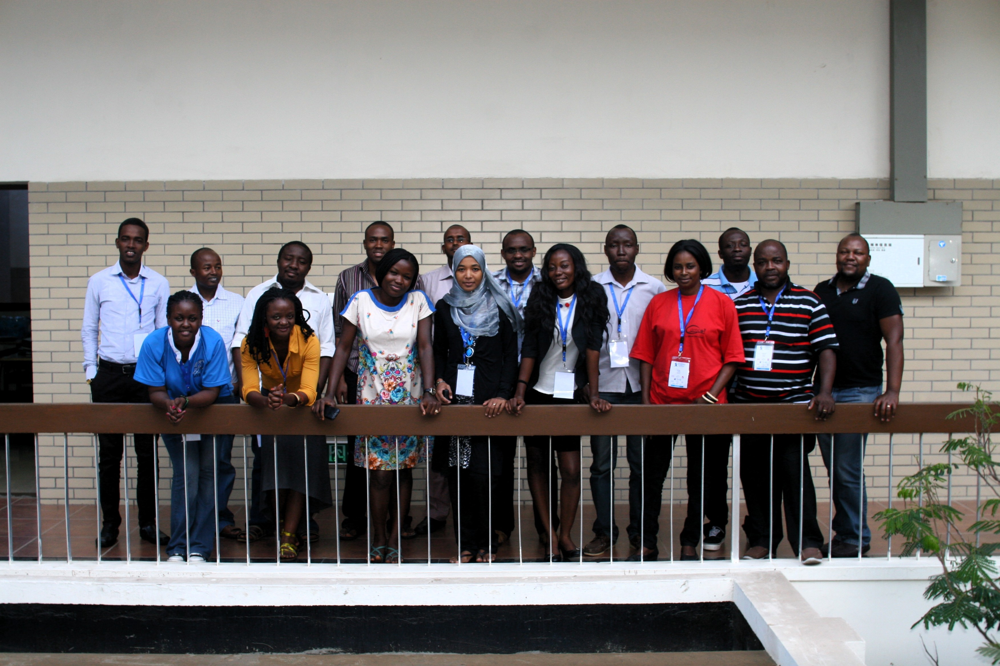

# AfNOG {{page.year}} Workshop on Network Technology

## Track SS-E: Scalable Internet Services

Jump within this page:

* [Introduction](#introduction)
* [Instructors](#instructors)
* [Timetable](#timetable)
* [Topics](#topics)
* [Management](#management)

<!-- sectionjumps -->

## Introduction

This course on Scalable Internet Services in English (SS-E) is part of the
[AfNOG {{page.year}} Workshop on Network Technology](http://www.ws.afnog.org/afnog{{page.year}}/index.html),
held in conjunction with the [AfNOG meeting](http://www.afnog.org/)
in Dakar, Senegal, April-May {{page.year}}.

We use hands-on training in a well-equipped classroom over a five-day period to teach skills required for the configuration and operation of large scale Internet services.

### Who should attend

Technical staff who are now providing Internet Services, or those who will be involved
in the establishment and/or provisioning of basic Internet Services.

### Prerequisites

Experience using and administering *NIX Servers, Name Servers, Web Servers, Mail Servers and similar services. Knowledge of Networking is a plus!

### Help!

You can get free help with any of the tutorials or materials on this site by joining
the [AfNOG mailing list](https://afnog.org/mailinglist.php) and sending an email to
[afnog@afnog.org](mailto:afnog@afnog.org) with your question or problem. Please note
that you must subscribe to the list first, otherwise your post will be rejected
automatically.

### Instructors

<table class="instructors">
	<thead><tr><th>Name</th><th>Initials</th><th>From</th><th>Country</th></tr></thead>
	<tbody>
		<!-- sorted by surname -->
		<tr id="IO"> <td>Isabel Odida</td> <td>IO</td> <td></td> <td>Uganda</td> </tr>
		<tr id="KC"> <td>Kevin Chege</td>    <td>KC</td> <td><a href="http://www.internetsociety.org">ISOC</a></td> <td>Kenya</td> </tr>
		<tr id="VA"> <td>Vitus Aborogu</td>    <td>VA</td> <td><a href="http://ghana.com">Ghana.Com</a></td> <td>Ghana</td> </tr>
		<tr id="MH"> <td>Manhal Mohamed</td>     <td>MH</td> <td><a href="http://www.sdnog.org">SdNOG</a></td> <td>Sudan</td> </tr>
		<tr id="EN"> <td>Michuki Mwangi</td> <td>MM</td> <td><a href="http://www.internetsociety.org">ISOC</a></td> <td>Kenya</td> </tr>
	</tbody>
</table>
<b> Lab setup with many thanks to Patrick Okui! </b>

### Participants

<!-- sorted by surname -->
<!-- Please note that the alignment line (|:-) does not work if it contains ANY tabs! So use spaces instead. -->

|First Names		|Surname	|Organisation				|Country
|:-                     |:-             |:-                                     |:-
|PENDING		|PENDING		|				|

### Timetable

|		|Monday			|Tuesday		|Wednesday		|Thursday		|Friday
|:-             |:-                     |:-                     |:-                     |:-                     |:-
|		|10/06			|11/06			|12/06			|13/06			|14/06
|09:00-11:00	|[Introduction][]	|[Data Security][]	|[Ansible][], 		|[Dovecot][], [Rainloop][]		|AntiSpam
|-
|Tea break
|11:30-13:00	|[DNS][]		|[DNS][]		|[Ansible][]		|[NTP][]		|[RADIUS][]
|-
|Lunch
|14:00-16:00	|[DNS][]	|[DNS][]		|[Postfix][]		|[Monitoring][]		|[Virtualization][]
|-
|Tea break
|16:30-18:30	|[Network Security][]		|[Apache][], |[Postfix][]		|[Monitoring][]	|Expert Panel and [Closing Survey][]
|-
|Supper
|**Evening Sessions:**   20:00-22:00	|General Help	|General Help	|General Help	|Instructor Dinner |Closing Ceremony
{: .timetable width="80%"}

## Topics

<!-- Please keep these topics in alphabetical order (except for Introduction first), thanks! -->

### Introduction
[Introduction]: #introduction

#### [Isabel Odida](#IO)

* Presentation:  [PDF](intro/IntroPresentation_2019.pdf)

### NTP
[NTP]: #ntp
* NTP Presentation: [NTP](ntp/ntp-service.pdf)
* NTP Exercise: [NTP Exercise](ntp/ntp-service-exercise.txt)

### Ansible
[Ansible]: #ansible

#### [Manhal Mohamed](#MH)

* Presentation: [PowerPoint](ansible/Ansible_Presentation2019.pptx) [PDF](ansible/Ansible_Presentation2019.pdf)

### Apache
[Apache]: #apache

#### [Isabel Odida](#IO)

* Presentation and Exercises: [PDF](apache/Apachepresentation2019.pdf)

### Backups
[Backups]: #backups

#### [Joe Abley](#JA)

* [Backups Presentation (OpenOffice Impress)](backups/regnauld-afnog2006-backups.sxi)
* [Backups Presentation (PDF)](backups/regnauld-afnog2006-backups.pdf)
* [Backups Exercise](backups/backups1-exercise1.txt)

### Closing Survey
[Closing Survey]: #closing-survey

#### [Chris Wilson](#CW)

* [AfNOG closing survey](https://survey.afrinic.net/index.php/survey/index/sid/843624/newtest/Y/lang/en)

### Configuration Management

#### [Laban Mwangi](#LM)

* [Exercise](config-mgmt/Readme.md)

### Data Security
[Data Security]: #data-security

#### [Joe Abley](#JA)

* [Presentation (PowerPoint)](pgp/pgp-presentation1.pptx)
* [Presentation (PDF)](pgp/pgp-presentation1.pdf)
* [PGP Exercise](pgp/pgp-exercise1.txt)
* [SSH Exercise](pgp/ssh-exercise1.txt)
* [Key File](pgp/pgp-presentation1.key)
* [Old NANOG Presentation](pgp/nanog29-jabley-pgp.pdf)

### Deployment
[Deployment]: #deployment

#### [Chris Wilson](#CW)

* Deployment Presentation: [HTML](deployment/index.html) [PDF](deployment/deployment_presentation.pdf)

### DNS
[DNS]: #dns

#### [Michuki Mwangi](#MM)

##### DNS Fundamentals
[DNS Fundamentals]: #dns-fundamentals

* [PowerPoint](dns/dns1-presentation.pptx)
* [PDF](dns/dns1-presentation.pdf)
* [Exercise](dns/dns1-exercise.txt)

##### DNS Resolvers
[DNS Resolver]: #dns-resolvers

* [PowerPoint](dns/dns2-presentation.pptx)
* [PDF](dns/dns2-presentation.pdf)
* [Exercise 1](dns/dns2-exercise1.txt)
* [Exercise 2](dns/dns2-exercise2.txt)
* [Exercise 3](dns/dns2-exercise3.txt)

##### DNS Authoritative Name Servers
[DNS Authoritative]: #dns-authoritative-name-servers

* [PowerPoint](dns/dns3-presentation.pptx)
* [PDF](dns/dns3-presentation.pdf)
* [Exercise](dns/dns3-exercise.txt)

##### DNSSEC
[DNSSEC]: #dnssec

Goal: DNSSEC High Level Awareness.

* [Presentation/PDF](dns/DNSSEC_High-Level_Awareness.pdf)
* [Presentation/Keynote](dns/DNSSEC_High-Level_Awareness.key)
* [Exercise/Text](dns/dns5-exercise.txt)

### Dovecot
[Dovecot]: #dovecot

#### [Kevin Chege](#KC)

* [Presentation/PPT](dovecot/dovecot-intro.ppt)
* [Presentation/PDF](dovecot/dovecot-intro.pdf)
* [Exercise 1 - Dovecot install](dovecot/dovecot-install-setup.txt)
* [Exercise 2 - LetsEncrypt](dovecot/letsencrypt-certificate.txt)
* [Exercise 3 - Enable SSL in Dovecot](dovecot/dovecot-ssl.txt)
* [Exercise 4 - IMAPS/POP3 Tests](dovecot/secure-IMAP-POP-commandline.txt)

### Ganeti
[Ganeti]: #ganeti

#### [Chris Wilson](#CW)

* Ganeti Presentation: to be written
* [Ganeti Exercise](virtualization/ganeti-exercise.html)

### Load Balancing
[Load Balancing]: #load-balancing

#### [Chris Wilson](#CW)

* [Web article on load balancing and scaling](https://www.digitalocean.com/company/blog/horizontally-scaling-php-applications/)
* [Presentation/PDF](loadbalancing/docs/sse-LB-overview.pdf)
* [Presentation/OpenOffice](loadbalancing/docs/sse-LB-overview.odp)

### MAAS
[MAAS]: #maas

#### [Chris Wilson](#CW)

* MAAS Presentation: to be written
* [MAAS reference](https://williamlsd.wordpress.com/2014/04/26/installing-local-cloud-infrastructure-using-ubuntu-14-04-lts-maas/)
* [MAAS Exercise](virtualization/maas-exercise.html)

### Monitoring
[Monitoring]: #monitoring

#### [Kevin Chege](#KC)

* [Monitoring IP Services](nagios/nagios-presentation.pdf)
* [Nagios Exercise-1](nagios/nagios-exercise1.txt)

### Network Security
[Network Security]: #network-security

#### [Kevin Chege](#KC)
#### [Manhal Mohammed](#MW)

* Firewalls Theory (Kevin): [PDF](firewalls/Firewalls_2019.pdf)
* Firewall exercise 1 (Manhal): [exercise](firewalls/ufw_debian.txt)
* Firewall exercise 2: [freebsd_firewall](firewalls/firewall_freebsd_ex.txt)

### OpenLDAP
[OpenLDAP]: #openldap

#### [Frank Kuse](#FK)

* Presentation: [PowerPoint](ldap/Openldap presentation.pptx) [PDF](ldap/Openldap presentation.pdf)
* Exercise: [PowerPoint](ldap/Openldap exercise.pptx) [PDF](ldap/Openldap exercise.pdf)

### Postfix
[Postfix]: #postfix

### Rainloop
[Rainloop]: #rainloop

Rainloop is a free to use WebMail client that does not require a MySQL database

* Installing Rainloop - Part 1[Exercise-1/Text](rainloop/rainloop-setup.txt)
* Installing Rainloop - Part 2[Exercise-2/PDF](rainloop/rainloop-part2.pdf)

#### [Kevin Chege](#KC)

+ Understanding email - [Email Overview](postfix/01_email_preso.pdf)
+ Postfix - [Introduction to Postfix](postfix/postfix_preso.pdf)
* Exercise 1 - Add MX records [Add MX record](postfix/add-MX-record.txt)
* Exercise 2 - [Installing Postfix](postfix/postfix_install.txt)
* Exercise 3 - [Command line Email](postfix/commandline_email.txt)
* Exercise 4 - [Postix Enable HELO](postfix/postfix_hardening.txt)
+ Some Email Best Practices -  [Email Best Practices](postfix/email_best_practices.pdf)

##### Spam Filtering
[Spam Filtering]: #spam-filtering

* Mail Gateway - Part 1 [MB-Part1](postfix/mg-part1.txt)

+ Email Filter Gateway [Email Filter aka Email Gateway](postfix/mailfilter_preso.pdf)
* Exercise 1 - [Debian Mail Gateway Part 1](postfix/mailgateway-pt1.txt)
* Exercise 2 - [Debian Mail Gateway Part 2](postfix/mailgateway-pt2.pdf)
* Exercise 3 - [Debian Mail Gateway Part 3](postfix/mailgateway-pt3.txt)
* Exercise 3 - [Debian Mail Gateway Part 3 PDF](postfix/mailgateway-pt3.pdf)
* Exercise 4 - [Test Your Mail Gateway](postfix/test_mailgateway.pdf)
* Additional Exercises - [Postfix Mail Forward HowTo](postfix/postfix_mailforward.txt)

### Squirrelmail
[Squirrelmail]: #squirrelmail
#### [Kevin Chege](#KC)

* [Presentation/PPT](squirrelmail/squirrelmail-intro.ppt)
* [Presentation/PDF](squirrelmail/squirrelmail-intro.pdf)
* [Exercise/Text](squirrelmail/squirrelmail-install-setup.txt)

### RADIUS
[RADIUS]: #radius

#### [Frank Kuse](#FK)

* Presentation: [PowerPoint](radius/radius_presentation_2016.ppt) [PDF](radius/radius_presentation_2016.pdf)
* Exercise: [PowerPoint](radius/FreeRadius Exercise 2016.pptx) [PDF](radius/FreeRadius Exercise 2016.pdf)

### Virtualization
[Virtualization]: #virtualization

#### [Isabel Odida](#IO)
* Virtualization Overview Presentation: [PDF](virtualization/virtualization_overview.pdf)

#### [Chris Wilson](#CW)

* [Intro Presentation (OpenOffice Impress)](virtualization/sse-virtualization-overview-2013.odp)
* [Intro Presentation (PDF)](virtualization/sse-virtualization-overview-2013_150527.pdf)
* [Virtualisation Concepts (PDF)](virtualization/virt-terminology.pdf) (thanks to NSRC!)
* [KVM Presentation (OpenOffice Impress)](virtualization/afnog_2015_virtualization_kvm_cw.odp)
* [KVM Presentation (PDF)](virtualization/afnog_2015_virtualization_kvm_cw_150527.pdf)
* [Ganeti Presentation (PDF)](virtualization/ganeti-overview.pdf) (thanks to NSRC!)
* [NSRC Training Materials](https://nsrc.org/workshops/2015/ripe-nsrc-virt/wiki/Agenda)

<!-- .topics -->

## Management

Details for project management of the SS-E workshop.

### Editing this page

Please [file an issue](https://github.com/afnog/sse/issues) requesting to be added as an administrator of the [AfNOG organisation on GitHub](https://github.com/afnog).

### Mailing list

The instructors group on Google Groups:

* Email address: [afnog-sse@googlegroups.com](mailto:afnog-sse@googlegroups.com)
* Web interface: [https://groups.google.com/forum/#!forum/afnog-sse](https://groups.google.com/forum/#!forum/afnog-sse)

There is a [wiki page on course development](https://github.com/afnog/sse/wiki/Operating-System-Choices).

### Equipment

To host this track you will probably need the following equipment:

* 2 x Mac Minis or similar, quad core i7 2Ghz+, 16GB Ram, 250 GB SSD (to host 16 virtual machines each)
* Projector: VGA required, HDMI optional, screen/wall. Mac VGA and HDMI adaptors.
* Wifi: ideally wired and wireless on the same SSID with /24.
* Wired Ethernet ports: probably 4-8 ports for people with broken wireless and for instructors in our classroom.
* Power strips: 12 x 4 socket.
* Spare machines: 4 x reasonable desktop/laptop with 1 GB RAM and permission to reformat and install Ubuntu or FreeBSD.
* Sun shading: to be able to read the projected screen and not overheat in our
rooms.
* White board, pens and eraser: at least 3 pens in 2 different colours.

### Setup

We usually use LXC containers, although not everything is supported (e.g. you can't run an iSCSI Target
in an LXC container yet), so there is an alternative setup using KVM virtual machines. These are much
heavier-weight, so you can't run as many on the same host (especially RAM is a limiting factor, since
each VM needs ~512 MB of dedicated RAM).

* [Server setup](setup/server/index.html) (Mac Mini)
* [LXC setup](setup/lxc/index.html) for ~40 containers
* [KVM setup](setup/kvm/index.html) for ~24 containers (alternative)
* [Admin howto](setup/howto/index.html) for the containers

### Administration

All done by CW unless anyone else wants to.

* Student numbers and names
* Classroom setup, networking, virtual machine images, cable management
* Notices - door, timetable, complaints box, wifi password
* Introductory talk - welcome, topic poll, complaints box
* Time management during the workshop (breaks, lunch, etc)
* Set alarms for break times
* Ensure that every topic has an instructor and enough time allocated
* Ensure that participants are receiving any assistance necessary
* Student name verification for certificates
* Coordinate the class group photo
* Liaise with the secretariat on any other issues that may be required
* Ensure that all course materials are placed on the workshop folder for CD burning at the end of the workshop
* Ensure that the participants complete and return the feedback form
* Download and serve any files needed, e.g. FreeBSD ISO images (for virtualisation) and packages (for pkg_add mirror)

### TODO

## Meta (about this site)

### Quick Start (editing)

If someone else is hosting, then all you have to do is:

* Request write access to the repositories below, or clone them (and use the clone URLs instead)
* Install SparkleShare
* Add `git@github.com:afnog/sse.git` to it
* Edit the Markdown files in `~/SparkleShare/sse/.../*.md`
* The host will detect your changes, generate the HTML and upload to Github and the local server.

### Quick Start (hosting)

Only one person should host a repository, otherwise you will duplicate work and maybe have race conditions
(although you should both be producing and updating the same content, so it should actually work if you
have more than one, but there's no point or advantage to it.)

If you want to host, you need a Linux or Mac desktop with `lsyncd`, `rsync` and `ruby` installed. Then follow
these steps:

* Add `git@github.com:afnog/afnog.github.io.git` to SparkleShare
* Install Jekyll for Ubuntu/Debian: `sudo gem install jekyll execjs therubyracer`
* Open a command prompt and go to ~/SparkleShare/sse
* Run `make serve`
* View the results in your browser at <http://localhost:4000/> (generated HTML files)

### Syncing to the Afnog webserver (ws.afnog.org) which runs FreeBSD

For updates to automatically sync to the webserver in use at the AFNOG workshop, do the following:
* Login to the NOC Box
* Install Jekyll `sudo pkg install rubygem-jekyll`
* Install the Jekyll gem if necessary `sudo gem install jekyll`
* Go to (replace XX with year) `cd /u/vol/www/vhosts/www.ws.afnog.org/data/afnog20XX`
* `sudo mkdir sse-git-afnog20XX`
* `cd sse-git-afnog20XX/`
* `git init`
* `git pull -p https://github.com/afnog/sse.git`
* `jekyll build --destination /u/vol/www/vhosts/www.ws.afnog.org/data/afnog20XX/sse/`
* look at this script [for a sample cron job](scripts/generate-index.html.script.txt)

### Source code (Markdown)

* Latest master is in [GitHub](https://github.com/afnog/sse).
* Edit online using GitHub's web editor, or:
* Clone an offline copy with Markdown source (no HTML) at `git@github.com:afnog/sse.git`.
* The syntax is parsed with Kramdown, which adds some useful [extensions](http://kramdown.gettalong.org/quickref.html).

### Generated HTML

* HTML files are auto-generated from Markdown by Jekyll - do not edit by hand!
* All files except those starting with `---` ([front matter](http://jekyllrb.com/docs/frontmatter/)) are copied literally from the source (`sse`) repository.
* Possibly outdated copy in [GitHub](https://github.com/afnog/afnog.github.io),
  [browsable online](http://afnog.github.io/sse/) at http://afnog.github.io/sse/.
* Clone an offline copy (HTML, not Markdown) at `git@github.com:afnog/afnog.github.io.git`.
* Some variables are stored in `_config.yml`, e.g. the year, and used with `{ { page.year } }` in HTML and Markdown files
  (spaces added to stop Markdown from replacing this with the year number!)

### Presentations

Presentations use a special format to invoke [remark](http://remarkjs.com/)
on the Markdown source files:

* The Markdown source is called `presentation.md` (so there can be only one
  per directory).
* In the same directory is a file called `index.md`, which tells Jekyll to
  use a specific layout (template file) to generate the HTML:
  `_layouts/presentation.html`.
* This file is generic and the same for all presentations. It loads the Remark
  source code, and then loads the `presentation.md` file from the same
  directory using AJAX. So the URL that you use to load it is very important
  in locating the correct `presentation.md` file.
* This means that you cannot use Kramdown extensions in presentations. No
  `presentation.html` files are generated because the `presentation.md` files
  deliberately do not have a "front matter" section which Jekyll requires.

### Generating the HTML

If you're using Ruby 1.8, you may need to
[install Ruby 1.9](https://leonard.io/blog/2012/05/installing-ruby-1-9-3-on-ubuntu-12-04-precise-pengolin/)
first.

**Warning**: This command by default will overwrite ../afnog.github.io/sse,
since it assumes that you have both https://github.com/afnog/sse/ and
https://github.com/afnog/afnog.github.io/ checked out side-by-side (for example
in [SparkleShare](http://sparkleshare.org/)).

If you want it to overwrite a different directory (where it will write the
generated HTML files), you can specify it as a command-line argument to Make:

	make DST_DIR=/tmp/site

You will need to install Jekyll to generate the HTML files:

	sudo gem install jekyll execjs therubyracer

Then run `make` to build them once, in the destination directory:

	make

Or run `make watch` to tell Jekyll to stay running, watch for source files
changing, and generate a new HTML file when they do (ideal for modifying
presentations on the fly):

	make watch

### Publishing the HTML

You can use `make sync` to run `lsyncd` (which you must have installed, for
example with `brew install lsyncd`) to automatically `rsync` the content to the
workshop server, http://www.ws.afnog.org.  You will need to check the
`SYNC_HOST` and `SYNC_DIR` in the `Makefile`, which must point to the
destination host and directory **which will be overwritten**.

	make sync

### Automatic publishing

If you want to have a server automatically fetch changes from Git and update
the static website, you can't use SparkleShare on the server because it's a GUI
tool. What you can do is checkout both Git repositories, using a fresh
[personal access
token](https://help.github.com/articles/creating-a-personal-access-token-for-the-command-line/)
to give it write access to the afnog.github.io repository, and "git pull" in a
loop (or automatically from Cron), generate the HTML and commit and publish it
if different (which is almost what SparkleShare does):

	git config --global user.name "Your Name"
	git config --global user.email you@example.com
	sudo apt install lsyncd rsync ruby ruby-dev gcc g++ make
	sudo gem install jekyll execjs therubyracer
	mkdir ~/website
	cd ~/website
	git clone https://github.com/afnog/sse.git
	git clone https://<your GitHub username>:<your token>@github.com/afnog/afnog.github.io.git
	git config --global push.default simple
	while true; do cd ~/website/sse; git pull; make autocommit; sleep 5; done

Or replace the last line with a Cron job:

	* * * * *	cd ~/website/sse; git pull; make autocommit
