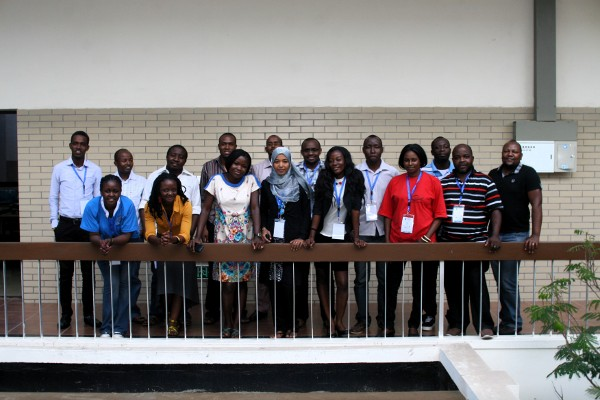

# AfNOG 2014 Workshop on Network Technology

## Track SS-E: Scalable Internet Services

Jump within this page:

* [Introduction](#introduction)
* [Instructors](#instructors)
* [Timetable](#timetable)
* [Topics](#topics)
* [Management](#management)

<!-- sectionjumps -->

## Introduction

This course on Scalable Internet Services is part of the [AfNOG 2014 Workshop on Network Technology](http://www.ws.afnog.org/afnog2014), held in conjunction with the [AfNOG meeting](http://www.afnog.org/)
in Djibouti, May-June 2014.

We use hands-on training in a well-equipped classroom over a five-day period to teach skills required for the configuration and operation of large scale Internet services.

### Who should attend

Technical staff who are now providing Internet Services, or those who will be involved in the establishment and/or provisioning of a basic national Internet Services in the country.

### Prerequisites

Experience using and administering *NIX Servers, Name Servers, Web Servers and Mail Servers.

### Instructors

<!-- sorted by surname -->

<table class="instructors">
	<thead><tr><th>Name</th><th>Initials</th><th>From</th></tr></thead>
	<tbody>
		<tr id="JA"> <td>Joe Abley</td>      <td>JA</td> <td>Canada</td> </tr>
		<tr id="KC"> <td>Kevin Chege</td>    <td>KC</td> <td>Kenya</td> </tr>
		<tr id="LM"> <td>Laban Mwangi</td> <td>LM</td> <td>Kenya</td> </tr>
		<tr id="EN"> <td>Evelyn Namara</td>  <td>EN</td> <td>Uganda</td> </tr>
		<tr id="CW"> <td>Chris Wilson</td>   <td>CW</td> <td>UK</td> </tr>
	</tbody>
</table>

### Participants

<!-- sorted by surname -->

<table class="participants">
	<thead><tr><th>Name</th><th>Country</th></tr></thead>
	<tbody>
		<tr><td>Frank Kwetei Quaynor</td><td>Ghana</td></tr>
	</tbody>
</table>

### Timetable

<table class="timetable" width="80%">
	<colgroup>
		<col width="10%" />
		<col width="10%" />
		<col width="10%" />
		<col width="10%" />
		<col width="10%" />
		<col width="10%" />
	</colgroup>
	<thead>
		<tr>
			<th></th>
			<th>Monday</th>
			<th>Tuesday</th>
			<th>Wednesday</th>
			<th>Thursday</th>
			<th>Friday</th>
		</tr>
		<tr>
			<td></td>
			<td>26/05</td>
			<td>27/05</td>
			<td>28/05</td>
			<td>29/05</td>
			<td>30/05</td>
		</tr>
	</thead>
	<tbody>
		<tr>
			<td class="time">
				09:00-11:00
			</td>
			<td class="mon">
				<a href="#introduction">SSE Intro/ee bootcamp</a>
			</td>
			<td class="tue">
				<a href="#dns">DNS</a>
			</td>
			<td class="wed">
				<a href="#dns">DNS</a>
			</td>
			<td class="thu">
				<a href="#ldap">LDAP</a>
			</td>
			<td class="fri">
				<a href="#dns">DNS</a>
			</td>
		</tr>
		<tr class="break">
			<td></td>
			<td colspan="5">Tea Break</td>
		</tr>
		<tr>
			<td class="time">
				11:30-13:00
			</td>
			<td class="mon">
				<a href="#apache">Apache</a>
			</td>
			<td class="tue">
				<a href="#loadbalancing">Load Balancing</a>
			</td>
			<td class="wed">
				<a href="#radius">RADIUS</a>
			</td>
			<td class="thu">
				<a href="#postfix">Postfix</a>
			</td>
			<td class="fri">
				<a href="#monitoring-and-logging">Monitoring and Logging</a>
			</td>
		</tr>
		<tr class="break">
			<td></td>
			<td colspan="5">Lunch</td>
		</tr>
		<tr>
			<td class="time">
				14:00-16:00
			</td>
			<td class="mon">
				<a href="#security">Nagios</a>
			</td>
			<td class="tue">
				<a href="#security-and-cryptography">Security and Cryptography</a>
			</td>
			<td class="wed">
				<a href="#dns">DNS</a>
			</td>
			<td class="thu">
				<a href="#configuration-management">Configuration Management</a>
			</td>
			<td class="fri">
				<a href="#ip-exploration">IP Exploration</a>
			</td>
		</tr>
		<tr class="break">
			<td></td>
			<td colspan="5">Tea Break</td>
		</tr>
		<tr>
			<td class="time">
				16:30-18:30
			</td>
			<td class="mon">
				<a href="#apache">Apache</a>
			</td>
			<td class="tue">
				<a href="#virtualization">Virtualization</a>
			</td>
			<td class="wed">
				<a href="#firewalls">Firewalls</a>
			</td>
			<td class="thu">
				<a href="#imap-imaps">IMAP/IMAPS</a>
			</td>
			<td class="fri">
				<a href="#security-and-availability">Security and Availability</a> 
				<a href="#closingsurvey">Closing Survey</a>
			</td>
		</tr>
		<tr class="break">
			<td>18:30-20:30</td>
			<td colspan="5">Dinner</td>
		</tr>
		<tr>
			<td class="time">
				Evening Sessions (20:00-22:00)
			</td>
			<td colspan="5">Closed</td>
		</tr>
	</tbody>
</table>

## Topics

### Introduction

#### [Chris Wilson](#CW)

* [Presentation](intro/index.html)
* [Opening Survey](https://www.surveymonkey.com/s/7Q88MH7)
* [Survey Results](http://afnog.github.io/sse/intro/opening-survey-results.pdf)

### Apache

#### [Evelyn Namara](#EN)

* [Presentation/PowerPoint](apache/apache.ppt)
* [Presentation/PDF](apache/apache.pdf)
* [Exercise1 - Apache Installation/SSL](http://afnog.github.io/sse/apache/apache_sse_exercises_apache+ssl.txt)
* [Exercise2 - MySQL/PHP/Wordpress Install](http://afnog.github.io/sse/apache/apache_sse_exercises_Mysql & PHP configs.txt)
* [Exercise3 - Wordpress Configuration](http://afnog.github.io/sse/apache/apache_sse_exercises_wordpress.txt)

### Security and Cryptography

#### [Chris Wilson](#CW)

* [Presentation/HTML](crypto/index.html)
* [Presentation/PDF](crypto/presentation.pdf)

### DNS

#### [Joe Abley](#JA)

##### Fundamentals

* [PowerPoint](dns/dns1-presentation.ppt)
* [PDF](dns/dns1-presentation.pdf)
* [Exercise](dns/dns1-exercise.txt)

##### DNS Caching and Debugging

* [PowerPoint](dns/dns2-presentation.ppt)
* [PDF](dns/dns2-presentation.pdf)
* [Exercise 1](dns/dns2-exercise1.txt)
* [Exercise 2](dns/dns2-exercise2.txt)
* [Exercise 3](dns/dns2-exercise3.txt)

##### Configuring Authoritative Name Servers

* [PowerPoint](dns/dns3-presentation.ppt)
* [PDF](dns/dns3-presentation.pdf)
* [Exercise](dns/dns3-exercise.txt)

##### Delegation and Reverse DNS

* [PowerPoint](dns/dns4-presentation.ppt)
* [PDF](dns/dns4-presentation.pdf)

### DNSSEC

#### [Joe Abley](#JA)

Goal: DNSSEC High Level Awareness.

* [Presentation/PDF](dns/DNSSEC_High-Level_Awareness.pdf)
* [Presentation/Keynote](dns/DNSSEC_High-Level_Awareness.key)
* [Exercise/Text](dns/dns5-exercise.txt)

### RADIUS

#### [Chris Wilson](#CW)

* [Presentation/OpenOffice](radius/radius_presentation.odp?raw=true)
* [Presentation/PDF](radius/radius_presentation_140528_cw.pdf?raw=true)

### Virtualization

#### [Laban Mwangi](#LM)

* Presentation/[PDF](https://github.com/afnog/sse/raw/master/virtualisation/docs/sse-virtualization-overview-2014.pdf)/[OpenOffice](https://github.com/afnog/sse/raw/master/virtualisation/docs/sse-virtualization-overview-2014.odp)
* Virtualization Exercise ([TXT](virtualisation/Readme.md))
* Virtualization with KVM ([PDF](virtualisation/afnog_2013_virtualization_kvm_cw_130610.pdf)/[OpenOffice](virtualisation/afnog_2013_virtualization_kvm_cw.odp))

### Load Balancing

#### [Laban Mwangi](#LM)

* [Presentation/PDF](loadbalancing/docs/sse-LB-overview.pdf)
* [Presentation/OpenOffice](loadbalancing/docs/sse-LB-overview.odp)

### Postfix

#### [Kevin Chege](#KC)

+ understanding email
+ Some Email Best Practices
+ Postfix and Dovecot

* [Email Overview](https://github.com/afnog/sse/raw/master/postfix/01_email_preso.pdf)
* [EmailBestPractices Postfix and Dovecot](https://github.com/afnog/sse/raw/master/postfix/postfix-preso.pdf)
* [Postfix Setup](https://raw.githubusercontent.com/afnog/sse/master/postfix/postfix-setup.txt)

### Firewalls

#### [Kevin Chege](#KC)

Goal: To understand firewalls and how the PF (Packet Filter) works

+ Block outgoing traffic on IPv6 and IPv4
+ Block incoming traffic on IPv6 and IPv4
+ Log the blocked traffic

* [FreeBSD Firewalls](https://github.com/afnog/sse/raw/master/firewalls/FreeBSD-firewalls.pdf)
* [PacketFilter Firewall Exercise-1](https://raw.githubusercontent.com/afnog/sse/master/firewalls/firewall_exercise-1.txt)
* [PacketFilter Firewall Exercise-2](https://raw.githubusercontent.com/afnog/sse/master/firewalls/firewall-exercise-2.txt)

### Internet Protocols

#### [Chris Wilson](#CW)

Goal: to understand the contents and layering of common Internet protocols

* [Exercise](ip/exercise.html)

#### [Kevin Chege](#KC)

Goal: To understand firewalls and how the PF (Packet Filter) works

+ Block outgoing traffic on IPv6 and IPv4
+ Block incoming traffic on IPv6 and IPv4
+ Log the blocked traffic

* [FreeBSD Firewalls](https://github.com/afnog/sse/raw/master/firewalls/FreeBSD-firewalls.pdf)
* [PacketFilter Firewall Exercise-1](https://raw.githubusercontent.com/afnog/sse/master/firewalls/firewall_exercise-1.txt)
* [PacketFilter Firewall Exercise-2](https://raw.githubusercontent.com/afnog/sse/master/firewalls/firewall-exercise-2.txt)

### Monitoring

#### [Kevin Chege](#KC)

* [Monitoring IP Services](nagios/nagios.pdf)
* [Nagios Exercise-1] (monitoring/nagios-exercise1.txt)
* [Nagios Exercise-2] (monitoring/nagios-exercise2.txt)
* [Smokeping Exercise] (monitoring/smokeping-exercise1.txt)

### Exim

#### [Chris Wilson](#CW)

* [Presentation/PDF](exim/afnog_2013_exim_presentation_130613.pdf)
* [Presentation/OpenOffice](exim/afnog_2013_exim_presentation.odp)
* [EICAR Anti-Virus Test File](exim/eicar)
* [Sample spam message](exim/spam.txt)

### Mail

#### [Kevin Chege](#KC)

##### Introduction to POP and IMAP

* [Presentation and Exercise/PDF](mail/dovecot-intro.pdf)
* [Presentation and Exercise/PowerPoint](mail/dovecot-intro.ppt)

##### Installing Dovecot Server

* [Presentation and Exercise/PDF](mail/dovecot-scaling.pdf)
* [Presentation and Exercise/PowerPoint](mail/dovecot-scaling.ppt)
* [Dovecot Basic Mysql Schema](mail/dovecot-mysql-schema.sql)

##### Webmail using Squirrelmail

* [Presentation/PDF](mail/squirrelmail.pdf)
* [Presentation/PowerPoint](mail/squirrelmail.ppt)

##### Scaling mail services

* [Mail Server Clustering](mail/clustering.htm)
* [Mail Server Scalability](mail/scalability.htm)

### Security and Availability

#### [Laban Mwangi](#LM)

* [Presentation/PDF](security/sse-sec-and-availability.pdf)
* [Presentation/ODP](security/sse-sec-and-availability.odp)

### Configuration Management

#### [Laban Mwangi](#LM)

* [Exercise](config-mgmt/Readme.md)

### Closing Survey

#### [Joel Jaeggli](#JJ)

* [Survey link](http://www.surveymonkey.com/s/7TD2J7T) (online)
* [Survey results](survey/2013_exit_survey_results.pdf) (PDF)

<!-- .topics -->

## Management

Details for project management of the training

### Editing this page

Please [file an issue](https://github.com/afnog/sse/issues) requesting to be added as an administrator of the [AfNOG organisation on GitHub](https://github.com/afnog).

### Mailing list

The instructors group on Google Groups:

* Email address: afnog-sse@googlegroups.com
* Web interface: https://groups.google.com/forum/#!forum/afnog-sse

### Topics and Instructors

* Welcome - CW?
* DNS - JA?
* RADIUS - CW
* Apache - EN
* Virtualization - LM
* Load Balancing - LM
* Monitoring - KC
* Exim - CW
* Mail (Dovecot, Webmail, scalability) - KC
* Security and Availability - CW
* Closing Survey - CW

See the [wiki page](https://github.com/afnog/sse/wiki/Operating-System-Choices).

### Coordinating the lab-setup

Who is arriving when?

* CW on 22/05 around 14h
* EN on 24/05
* KC on 25/05 early morning
* JA on 25/05 at 0900

### Administration

All done by CW unless anyone else wants to.

* Student numbers and names
* Classroom setup, networking, virtual machine images, cable management
* Notices - door, timetable, complaints box, wifi password
* Introductory talk - welcome, topic poll, complaints box
* Time management during the workshop (breaks, lunch, etc)
* Set alarms for break times
* Ensure that every topic has an instructor and enough time allocated
* Ensure that participants are receiving any assistance necessary
* Student name verification for certificates
* Coordinate the class group photo
* Liaise with the secretariat on any other issues that may be required
* Ensure that all course materials are placed on the workshop folder for CD burning at the end of the workshop
* Ensure that the participants complete and return the feedback form
* Download and serve any files needed, e.g. FreeBSD ISO images (for virtualisation) and packages (for pkg_add mirror)

### TODO

* Student numbers and names

## Meta (about this site)

### Source code (Markdown)

* Latest master is in [GitHub](https://github.com/afnog/sse).
* Clone an offline copy with Markdown source (no HTML) at `git@github.com:afnog/sse.git`.

### Generated HTML

* Created with [gollum-site](https://github.com/dreverri/gollum-site) from the source code.
* Possibly outdated copy in [GitHub](https://github.com/afnog/afnog.github.io).
* [Browsable online](http://afnog.github.io/sse/) at http://afnog.github.io/sse/.
* Clone an offline copy (HTML, not Markdown) at `git@github.com:afnog/afnog.github.io.git`.

### Presentations

Presentations use a special format to invoke [remark](http://remarkjs.com/)
on the Markdown source files:

* The Markdown source is called `presentation.md` (so there can be only one
  per directory).
* In the same directory is a file called `index.md`, which tells Jekyll to
  use a specific layout (template file) to generate the HTML:
  `_layouts/presentation.html`.
* This file is generic and the same for all presentations. It loads the Remark
  source code, and then loads the `presentation.md` file from the same
  directory using AJAX. So the URL that you use to load it is very important
  in locating the correct `presentation.md` file.

### Generating the HTML

If you're using Ruby 1.8, you may need to
[install Ruby 1.9](https://leonard.io/blog/2012/05/installing-ruby-1-9-3-on-ubuntu-12-04-precise-pengolin/)
first.

**Warning**: This command by default will overwrite ../afnog.github.io/sse,
since it assumes that you have both https://github.com/afnog/sse/ and
https://github.com/afnog/afnog.github.io/ checked out side-by-side (for example
in [SparkleShare](http://sparkleshare.org/)).

If you want it to overwrite a different directory (where it will write the
generated HTML files), you can specify it as a command-line argument to Make:

	make DST_DIR=/tmp/site

You will need to install Jekyll to generate the HTML files:

	sudo gem install jekyll execjs therubyracer

Then run `make` to build them once, in the destination directory:

	make

Or run `make watch` to tell Jekyll to stay running, watch for source files
changing, and generate a new HTML file when they do (ideal for modifying
presentations on the fly):

	make watch

### Publishing the HTML

You can use `make sync` to run `lsyncd` (which you must have installed) to
automatically `rsync` the content to the workshop server, http://www.ws.afnog.org.
You will need to check the `SYNC_HOST` and `SYNC_DIR` in the `Makefile`,
which must point to the destination host and directory **which will be overwritten**.

	make sync
