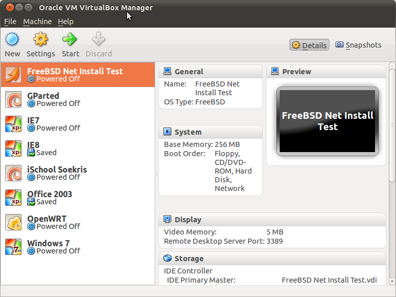
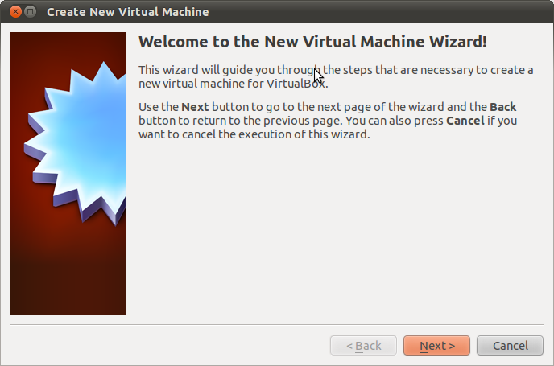

# Class Virtualisation Setup

Practical exercise: install OpenBSD in a virtual machine on your own PC.

## System Requirements

You will need:

* A laptop or desktop (Windows, Macintosh, Linux or FreeBSD)
* About 2 GB RAM
* About 20 GB free disk space
* Administrative rights (root access)
* A CD or DVD drive or wireless card

If your laptop doesn't meet these specs: Work with a partner. (We may be able to provide a few spare machines, but not guaranteed.)

## Virtualbox

### CD or Wireless?

If possible, please use a OpenBSD ISO image. 
* Get it from http://mini1.sse.ws.afnog.org/~inst/openbsd/

### Installing VirtualBox

We have local copies at:
* http://mini1.sse.ws.afnog.org/~inst/virtualbox/

For other platforms, please visit:
* http://www.virtualbox.org/wiki/Downloads

### Running VirtualBox

On Windows:
* Start/Programs/Oracle VM VirtualBox

On Mac OS X:
* Hard Disk/Applications/Oracle VM VirtualBox

On FreeBSD:
* Open a terminal and type VirtualBox

On Linux:
* Applications/System Tools/Oracle VM VirtualBox, or
* Search for VirtualBox (Ubuntu Unity), or
* Open a terminal and type VirtualBox

### VirtualBox Main Window



* List of virtual machines (Probably empty!)
* Settings of the selected virtual machine
* Screen preview
* Toolbar buttons to control VMs: New, Settings, Start

### Creating a Virtual Machine



* Click *New* to create a new virtual machine
* Type FreeBSD as the name
* Choose _BSD_ as the type, and _OpenBSD (32 bit)_ as the version
* Virtual RAM:
  * Use less than half your machine's total RAM
  * 256MB is an acceptable minimum
* Virtual hard disk:
  * Dynamic expanding, 8 GB 

### Hold your horses!

* Don't start it yet!
* Need to change settings so that the instance boots off the ISO image
** Right click the image and click on settings
** Click on storage and then cd image under the storage tree section
** Under the attributes section, click on the small cd rom icon next to the CDROM dropdown list.
** In the file selection dialog, choose the openBSD image that you just downloaded to your machine
** Save and start the instance

### Go!
Boot the machine and follow the prompts (See the slides for pointers).
* Choose an interactive installation
* Elect to not run X windows
* Let the machine auto layout the partitions
* Ignore the SHA256 signature error. Type  '''yes'''
* Type reboot when the installation is done
* Intercept the reboot and power down the VM so that you can adjust the boot priority settings.

Once boot priority has been adjusted (Right click VM -> Settings -> System -> Boot order), boot the machine


## Vagrant

Install vagrant from the local server on your laptop
* Vagrant installers can be found here: http://mini1.sse.ws.afnog.org/~inst/vagrant_installers/

* Make a vagrant file by issuing vagrant init
```sh
$ vagrant init
```

* Edit the vagrantfile and change using ee:
** Original
```
config.vm.box = "base"
```
**  Desired change
```
config.vm.box = "http://mini1.sse.ws.afnog.org/~inst/vagrant_boxes/hashicorp/precise32/version/1/provider/virtualbox.box"
```

* Start the VM
```sh
$ vagrant up

    ==> default: Box 'http://mini1.sse.ws.afnog.org/~inst/vagrant_boxes/hashicorp/precise32/version/1/provider/virtualbox.box' could not be found. Attempting to find and install...
    default: Box Provider: virtualbox
    default: Box Version: >= 0
    ==> default: Adding box 'http://mini1.sse.ws.afnog.org/~inst/vagrant_boxes/hashicorp/precise32/version/1/provider/virtualbox.box' (v0) for provider: virtualbox
    default: Downloading: http://mini1.sse.ws.afnog.org/~inst/vagrant_boxes/hashicorp/precise32/version/1/provider/virtualbox.box
    ==> default: Successfully added box 'http://mini1.sse.ws.afnog.org/~inst/vagrant_boxes/hashicorp/precise32/version/1/provider/virtualbox.box' (v0) for 'virtualbox'!
    ==> default: Importing base box 'http://mini1.sse.ws.afnog.org/~inst/vagrant_boxes/hashicorp/precise32/version/1/provider/virtualbox.box'...
    ==> default: Matching MAC address for NAT networking...
    ==> default: Setting the name of the VM: virts_default_1401192233099_60272
    ==> default: Clearing any previously set network interfaces...
    ==> default: Preparing network interfaces based on configuration...
    default: Adapter 1: nat
    ==> default: Forwarding ports...
    default: 22 => 2222 (adapter 1)
    ==> default: Booting VM...
    ==> default: Waiting for machine to boot. This may take a few minutes...
    default: SSH address: 127.0.0.1:2222
    default: SSH username: vagrant
    default: SSH auth method: private key
    default: Warning: Connection timeout. Retrying...
    ==> default: Machine booted and ready!
    ==> default: Checking for guest additions in VM...
    default: The guest additions on this VM do not match the installed version of
    default: VirtualBox! In most cases this is fine, but in rare cases it can
    default: prevent things such as shared folders from working properly. If you see
    default: shared folder errors, please make sure the guest additions within the
    default: virtual machine match the version of VirtualBox you have installed on
    default: your host and reload your VM.
    default:
    default: Guest Additions Version: 4.2.0
    default: VirtualBox Version: 4.3
    ==> default: Mounting shared folders...
    default: /vagrant => /Users/lmwangi/work/virts
```

* Connect to the instance
```sh
  # Connect to your instance
  $ vagrant ssh
```

Notes
* You just provisioned an instance in minutes
* You can now configure this instance for a service
* You can change to another directory and repeat the process to get another instance
** Run: vagrant init
** Edit the file: Vagrantfile
** Run: vagrant up

### Exercise: 
Create a new FreeBSD vm using this box:
http://mini1.sse.ws.afnog.org/~inst/vagrant_boxes/chef/freebsd-9.2/version/1/provider/virtualbox.box

Hint
** Run: vagrant init
** Edit the file: Vagrantfile to change the box setting
** Run: vagrant up
