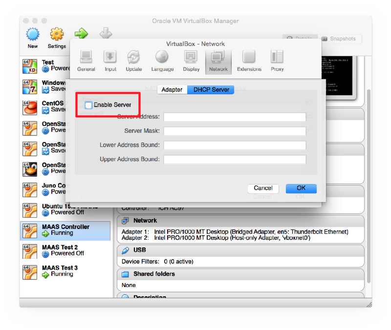
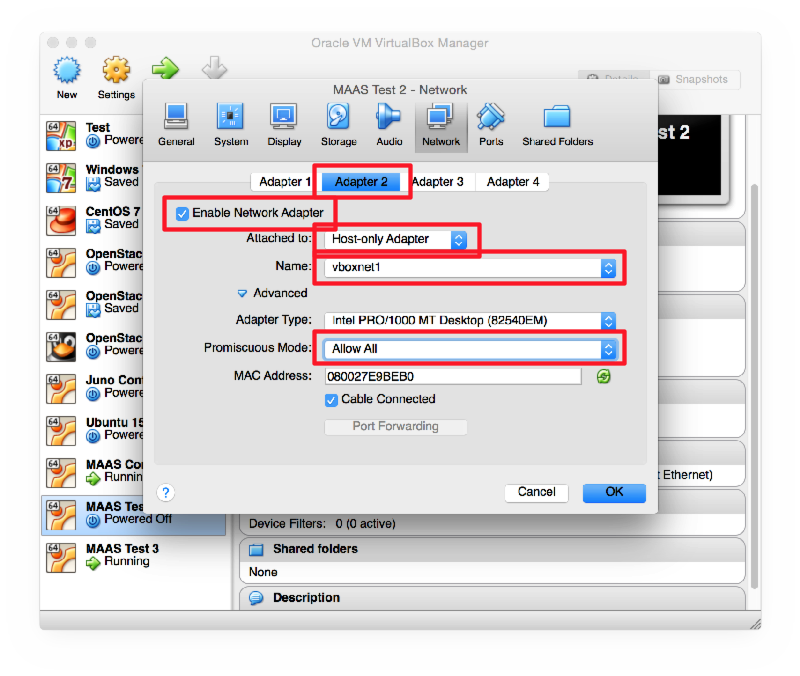
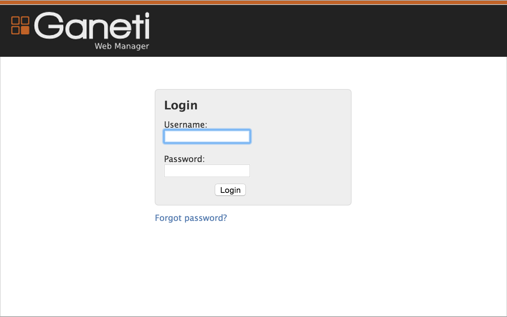
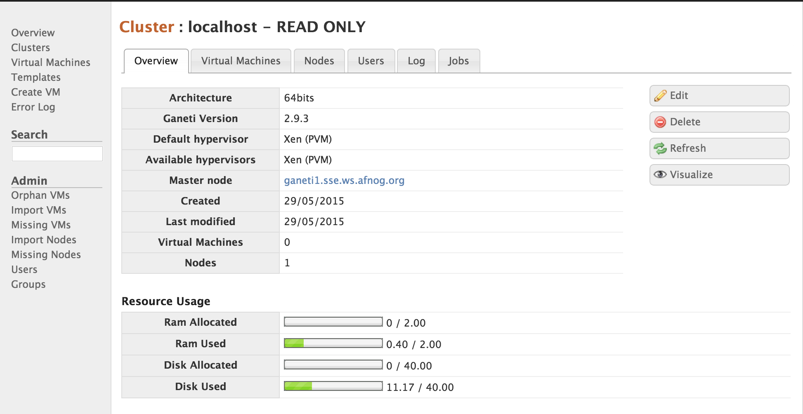

# Ganeti Exercise

[Ganeti](https://code.google.com/p/ganeti/) is a virtual machine cluster
management tool developed by Google. The solution stack uses either Xen or KVM
as the virtualization platform, LVM for disk management, and optionally DRBD
for disk replication across physical hosts.

We will install Ganeti in a virtual machine, configure it to use the Xen
hypervisor, and use it to create and manage some virtual machines.

Normally you would install this on your physical hosts. We are using it in a
VirtualBox virtual machine which is pretending to be our physical host, because
we don't have enough physical boxes for everyone. This forces us to use Xen
(which is slower than KVM) because we can't use KVM inside a VirtualBox virtual
machine. You could use either for a real deployment. The installation process
is slightly different. KVM is not covered here.

## Installing the first host machine

Install VirtualBox or make sure you are running version 4.3 or higher.

Open VirtualBox Preferences > Network > Host-Only Adaptors. Ensure that you
have at least two listed: vboxnet0 and vboxnet1. If not, click on the Add
button to the right of the list to create them.

Double-click on *vboxnet0* and check that the IP addresses are as follows:

* IP address: 192.168.56.1
* Subnet mask: 255.255.255.0

And check that the DHCP server is enabled and configured for:

* Server address: 192.168.56.1
* Server mask: 255.255.255.0
* Lower address bound: 192.168.56.100
* Upper address bound: 192.168.56.200

If you have made any changes, then **exit and restart VirtualBox**, otherwise
this change will not take effect, as we discovered after an hour of debugging!

Create a new VM called Ganeti Demo. Give it 2 GB RAM and a 40 GB VDI disk,
dynamically sized.

### Starting Installation

Start the VM and attach the debian-8.x.x-amd64-DVD-1.iso image. Read the
following sections **before** you start the installation, and use them at the
appropriate times during the
installation.

#### Hostname

You must use a fully qualified hostname, for example `ganeti.pcXX.sse.ws.afnog.org`.

#### Partitioning

The server should use LVM for disk space, so instead of the default *Guided
Partitioning*, choose *Manual*, then *SCSI1*. Write a new partition table if prompted.

* Select *pri/log free space*, *Create a new partition*, `max`, *Primary*,
  *Use as > Physical volume for LVM*, *Done*.
* Select *Configure the Logical Volume Manager*:
	* Select *Create volume group*
	* Enter a name for the new main volume group, for example `xenvg`. Select device `/dev/sda1`.
	* Select *Create logical volume*, enter the *Name* `Root` and *Size* `8GB`.
	* Select *Create logical volume*, enter the *Name* `Swap` and *Size* `4GB`.
	* Select *Finish*.
* Select *LVM VG xenvg, LV Root* -> *#1 8.0 GB*:
	* Select *Use as > Ext4 journalling filesystem*.
	* Select *Mount point > / (root)*.
	* Select *Done setting up the partition*.
* Select *LVM VG xenvg, LV Swap* -> *#1 4.0 GB*:
	* Select *Use as > swap area*.
	* Select *Done setting up the partition*.
* Select *Finish partitioning and write changes to disk*.

#### Proxy Server

If you are following this exercise at an AfNOG event, please enter this proxy
server name when prompted, to save a LONG install time:

* <http://196.200.223.144:3142>

Please enter this carefully and check it. Using the wrong value will make it
impossible for you to install any packages.  Of course, if you are not at the
AfNOG workshop then this server will no longer exist, so use a local proxy
server or leave it blank.

While the installation proceeds, familiarise yourself with the terminology of
[Ganeti](http://docs.ganeti.org/ganeti/2.15/html/admin.html#ganeti-terminology).

#### Software selection

Enable installation of the *SSH Server* and *Standard system utilities*,
disable everything else.

### Network Re-Configuration

After installation, shut down the machine and reconfigure its network interfaces in VirtualBox

* Adapter 1: Do not change, leave set to NAT.
* Adapter 2: Host-only network, vboxnet0, enable Promiscuous Mode.

Then start the machine again. Log in on the console and install some packages:

	su
	apt install bridge-utils sudo
	usermod -G sudo afnog

Then edit `/etc/network/interfaces` to look like this:

	# The loopback network interface
	auto lo
	iface lo inet loopback

	# The primary network interface
	auto eth1
	iface eth0 inet dhcp

	auto eth1
	iface eth1 inet static
		address 0.0.0.0
		netmask 255.255.255.255

	auto xen-br0
	iface xen-br0 inet static
		address 192.168.56.10
		netmask 255.255.255.0
		bridge_ports eth1
		bridge_stp off
		bridge_fd 0

### Hostnames and DNS

Edit `/etc/hostname` and put the fully-qualified hostname (FQDN) in there.

Edit `/etc/hosts` and ensure that it contains the IP address and hostname of
your host. You will also need to choose a name (hostname) and IP address for
your cluster, which must be different. For example:

	127.0.0.1       localhost
	192.168.56.10   ganeti.pcXX.sse.ws.afnog.org
	192.168.56.11   cluster.pcXX.sse.ws.afnog.org

Normally you would add DNS entries for all of these. Feel free to use the DNS
for the cluster name, instead of editing `/etc/hosts`. Your hostname should
really be in the DNS as well, but for the purposes of this exercise
(non-production deployment) it doesn't matter too much.

### Configure Xen

Edit `/etc/default/grub` and change the following lines to enable Xen (you would
not need this for a KVM cluster in production):

	GRUB_DEFAULT=saved
	GRUB_CMDLINE_XEN_DEFAULT="dom0_mem=min:600M,max:600M"

This restricts the master domain to 600 MB RAM, which will make it slow, but give us more RAM free
for guests. In your own configurations you should probably allocate more RAM to the host (domain 0)!

Then run the following commands:

	sudo update-grub
	sudo apt-get dist-upgrade	
	sudo apt-get install xen-linux-system-amd64

Then `reboot` the host. Be sure to select a Xen kernel from the boot list. Log in again and check
that the `free` command reports 500 MB of total Mem, not 2 GB:

	afnog@ganeti:~$ free
		     total       used       free     shared    buffers     cached
	Mem:        437896

### Install DRBD

The Ganeti manual has instructions for this, but they are confusing and
out-of-date for Debian >= Wheezy, so we skip that step and do it here instead:

	sudo apt install drbd-utils

Edit `/etc/modprobe.d/drbd.conf` and make it look like this:

	options drbd minor_count=128 usermode_helper=/bin/true

Edit `/etc/modules` and add the following line at the end:

	drbd

Load the kernel module (driver) now:

	sudo modprobe drbd

### Continue Ganeti installation

Start by running the following commands:

	sudo apt install ganeti ganeti-instance-debootstrap

Then start following the [Ganeti installation tutorial](http://docs.ganeti.org/ganeti/2.15/html/install.html),
skipping the following sections:

* Anything to do with KVM (we're using Xen instead)
* Installing DRBD (we already did that)
* Installing RBD: skip to
  [Installing Gluster](http://docs.ganeti.org/ganeti/2.15/html/install.html#installing-gluster) instead.
* KVM userspace access
* Configuring the network
* Configuring LVM: only follow the "Optional" step to configure LVM not to scan the DRBD devices for physical volumes. 
* Installing Ganeti: stop following at this point.

### Initializing the Cluster

Run the following command, substituting the cluster name you added to
`/etc/hosts` instead of `cluster1...`:

	sudo mkdir /root/.ssh
	sudo gnt-cluster init --vg-name xenvg --enabled-hypervisors=xen-pvm -H xen-pvm:xen_cmd=xl cluster.pcXX.sse.ws.afnog.org

The `gnt-cluster` command should take a few minutes to complete.

**Note:** Normally you would use either `xen-hvm` or `kvm` as the hypervisor,
instead of `xen-pvm` above. In this case we must use `xen-pvm` because we are
doing this inside a virtual machine, so we can't use the virtualisation CPU
instructions because VirtualBox is already using them to run the Ganeti host
node (VirtualBox guest).

Create the file `/etc/ganeti/vnc-cluster-password` containing the password that
you want to use for VNC access to consoles.

### Testing the Setup

Check that the `gnt-node list` command shows your node:

	$ sudo gnt-node list
	Node                     DTotal DFree MTotal MNode MFree Pinst Sinst
	ganeti1.sse.ws.afnog.org  40.0G 28.8G   2.0G  1.9G  126M     0     0

> **Warning:** If you see question marks in all the columns after the node name, like this:
>
>	$ sudo gnt-node list
>	Node                     DTotal DFree MTotal MNode MFree Pinst Sinst
>	ganeti1.sse.ws.afnog.org      ?     ?      ?     ?     ?     0     0
>
> that means that Ganeti cannot retrieve information about your node. Check the node daemon logfile
> `/var/log/ganeti/node-daemon.log` for possible error messages. For example, if you find this error:
>
>	ERROR Can't retrieve xen hypervisor information (exited with exit code 1): ERROR:  A different toolstack (xl) have been selected!
>
> that means that Ganeti is trying to use the old `xm` command to get information, instead of the new `xl` command,
> and not getting any information. You probably forgot to add the option `-H xen-pvm:xen_cmd=xl` when you created
> the cluster. You can fix it by modifying the cluster settings on the node:
>
>	sudo gnt-cluster modify -H xen-pvm:xen_cmd=xl
>
> and check that the `gnt-node list` now shows the correct information for your node.
{: .warning}

You should also make sure that the `MFree` column shows at least 1 GB free (not
126 MB as in the example output above). This ensures that there is enough RAM
free in the hypervisor to create new guests. Otherwise you won't be able to do
much with your new hypervisor. If it doesn't show enough free RAM, check that
you have [reconfigured GRUB and run
`update-grub`](http://askubuntu.com/a/191489/49566).

Test that you can run the following useful commands and examine their output:

	sudo gnt-cluster verify
	sudo gnt-node list
	sudo gnt-instance list
	sudo gnt-job list

The [Ganeti manual page](http://docs.ganeti.org/ganeti/2.15/html/man-ganeti.html) gives
useful information about Ganeti commands, including examples.

Add an entry to `/etc/hosts` for a host to use for burnin testing, for example `burnin.example.com`:

	192.168.56.12   burnin.example.com

The `burnin` test will
[fail](https://groups.google.com/forum/#!topic/ganeti/ds0TwfroS8A) unless we
generate a DH parameters file for SSL:

	openssl dhparam -out dhparams.pem 2048
	cat dhparams.pem | sudo tee -a /var/lib/ganeti/server.pem

Run the `burnin` test to make sure that everything is working properly:

	sudo /usr/lib/ganeti/tools/burnin -o debootstrap+default -t plain --disk-size 1024 --mem-size=512 burnin.example.com -vv

The output should end with:

	- Checking confd results
	  * Ping: OK
	  * Master: OK
	  * Node role for master: OK
	- Stopping and starting instances
	  * instance burnin.example.com
	- Removing instances
	  * instance burnin.example.com

### Enable Remote API

Choose a username and password for your remote account (`jack` and `mypassword` in this case) and
generate a hash using `echo` and `openssl md5` like this:

	$ echo -n 'jack:Ganeti Remote API:mypassword' | openssl md5
	(stdin)= 5ede44dba4dd4e9ce3909246515b2cdc

Insert them both into `/var/lib/ganeti/rapi/user`, prefixing the password hash
with `{ha1}`, and giving this user `write` permissions:

	jack	{ha1}5ede44dba4dd4e9ce3909246515b2cdc	write

### Install the Web Manager

Download the [latest
release](https://code.osuosl.org/projects/ganeti-webmgr/files), for example
0.11.0. We have a local copy which you can download here:

	wget http://sse-mini1.mtg.afnog.org/ganeti_webmgr-0.11.0.tar.gz

Then run the following commands to install it:

	sudo apt install fabric python-virtualenv python-dev libffi-dev libssl-dev patch apache2 libapache2-mod-wsgi
	sudo mkdir -p /opt
	tar xzvf ganeti_webmgr-0.11.0.tar.gz
	sudo mv ganeti_webmgr-0.11.0 /opt/ganeti_webmgr
	cd /opt/ganeti_webmgr
	mv requirements/production.txt requirements/prod.txt
	mv ganeti_webmgr/manage.py .
	mkdir config
	cp ganeti_webmgr/ganeti_web/settings/config.yml.dist config/config.yml
	cd ganeti_webmgr/ganeti_web/settings
	cp settings.py.dist ../settings.py
	sudo chown -R www-data /opt/ganeti_webmgr

Apply a patch to make Fabric download Ganeti's dependencies using a proxy. This should only 
be done at an AfNOG workshop, or an environment where you are forced to use a proxy:

	cd /tmp
	wget http://afnog.github.io/sse/virtualization/ganeti.patch
	cd /opt/ganeti_webmgr
	sudo patch -p0 < /tmp/ganeti.patch

Then deploy the web interface:

	cd /opt/ganeti_webmgr
	sudo fab deploy

Run this command to generate a new secret key:

	openssl rand -base64 24

Edit `config/config.yml` and add the following lines at the end:

	SECRET_KEY: "YZVfMJmDGfk9jSlZ+S6sAT2288he8cEX"
	WEB_MGR_API_KEY: "YZVfMJmDGfk9jSlZ+S6sAT2288he8cEX"

Also change the `EMAIL_HOST` and `DEFAULT_FROM_EMAIL` lines, so that their values refer to your outbound server and your email address.

Save the file, and check the configuration for errors:

	cd /opt/ganeti_webmgr
	sudo -u www-data venv/bin/python manage.py syncdb --migrate
	sudo -u www-data venv/bin/python manage.py runserver 0.0.0.0:8000

This will start the debugging webserver on port 8000, so you can check that everything is working
by visiting http://192.168.56.10:8000. You should get a white page with a login and password box,
but no styling (colours, images, etc.) If not, check the console output for error messages.

Create the file `/opt/ganeti_webmgr/wsgi.py` with the following contents:

	import os
	import sys

	path = '/opt/ganeti_webmgr'

	# activate virtualenv
	activate_this = '%s/venv/bin/activate_this.py' % path
	execfile(activate_this, dict(__file__=activate_this))

	# add project to path
	if path not in sys.path:
	    sys.path.append(path)

	    # configure django environment
	    os.environ['DJANGO_SETTINGS_MODULE'] = 'ganeti_webmgr.ganeti_web.settings'

	    import django.core.handlers.wsgi
	    application = django.core.handlers.wsgi.WSGIHandler()

Create the file `/etc/apache2/sites-enabled/ganeti.conf` with the following contents:

	WSGIPythonHome /opt/ganeti_webmgr/venv
	WSGISocketPrefix /var/run/wsgi
	WSGIRestrictEmbedded On

	<VirtualHost *:80>
		ServerAdmin your-email-address@example.com
		ServerName ganeti-server.local
		ServerAlias 192.168.56.10

		# Static content needed by Django
		Alias /static "/opt/ganeti_webmgr/collected_static/"
		<Location "/static">
			Order allow,deny
			Allow from all
			SetHandler None
		</Location>

		# Django settings - AFTER the static media stuff
		WSGIScriptAlias / /opt/ganeti_webmgr/wsgi.py
		WSGIDaemonProcess ganeti processes=1 threads=10 display-name='%{GROUP}' deadlock-timeout=30
		WSGIApplicationGroup %{GLOBAL}
		WSGIProcessGroup ganeti

		# Possible values include: debug, info, notice, warn, error, crit,
		# alert, emerg.
		LogLevel warn

		<Location />
			Require all granted
		</Location>
	</VirtualHost>

Now you should be able to access http://192.168.56.10/ (without the :8000 port specification)
and see the login page with graphics:

Log in using the superuser account that you created during the `syncdb`
command, or if you have forgotten the details, run this command to create a new
one:

	sudo -u www-data venv/bin/python manage.py createsuperuser

Choose *Clusters* from the menu on the left, and then click *Add Cluster* in the top right.
Enter the following details:

* Hostname: localhost
* Port: 5080
* Description: My Cluster

Leave the other details blank, and click *Add*. Your new cluster should then
appear with its specifications:

