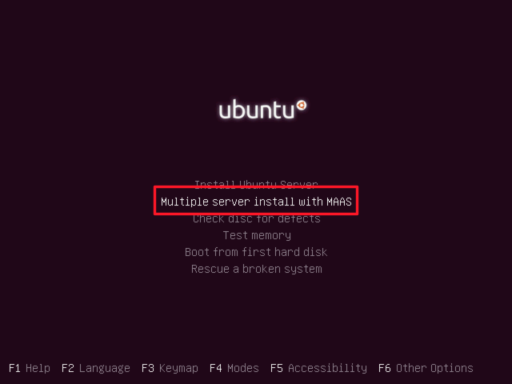

# MAAS Exercise

MAAS is not a virtualisation system. It's an OS deployment tool. We will use it later to deploy
software quickly, such as OpenStack, which we can use for virtualisation.

MAAS is normally installed on physical machines. We don't have enough physical machines, so we
will use virtual machines in this lab.

## Install the MAAS Controller

Every MAAS setup requires a controller server. Needs about 20 GB disk space (for OS images to deploy)
and 2 GB RAM. (why?)

Install VirtualBox. Create a new VM called MAAS Controller. Give it 1 GB RAM and a 40 GB VDI disk,
dynamically sized.

Start the VM and attach the Ubuntu 14.04 Server 64-bit CD. Choose the *Multiple server installation
with MAAS* option:

