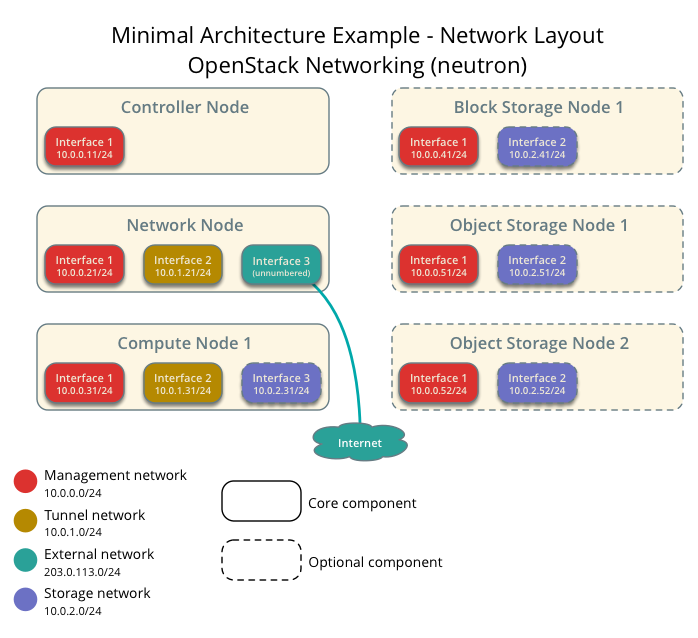

# Virtualization with OpenStack

.height_8em[]

### Chris Wilson, AfNOG 2015

You can access this presentation at: http://afnog.github.io/sse/virtualization/
([edit](https://github.com/afnog/sse/firewalls/virtualization.md))

---

## What will we do?

.fill[]

---

## Why are we doing it?

Rapid deployments

* Redundancy
* Fault tolerance
* Scalability
* Managed by [Juju](https://jujucharms.com/)

???

Juju can provision virtual machines on:

* commercial providers (e.g. EC2)
* our OpenStack cluster
* bare metal (MAAS)

---

## How will we do it?

* Create 3 virtual machines
* Install Ubuntu
* Install OpenStack "Kilo" components
  * Roughly following the instructions at:
    http://docs.openstack.org/kilo/install-guide/install/apt/content/index.html
* Requirements: A PC with 4 GB RAM, 20 GB free disk space

---

## Install VirtualBox

* You can find installers and packages at: https://www.virtualbox.org/wiki/Downloads

---

## Create Networks

.fill[]

---

## Create Networks

.center.height_8em[]

* Create four NAT networks:
  * "External" - 10.196.1.0/24
  * "Management" - 10.196.2.0/24
  * "Tunnel" - 10.196.3.0/24
  * "Storage" - 10.196.4.0/24

---

## Create a Virtual Machine

* Named "OpenStack Compute 1"
  * One of our three virtual machines, the Compute Node
* Allocate 1024 MB RAM, 20 GB disk space
  * Name the disk image "Trusty OpenStack"
* Configure network devices:
  * Interface 1: Management
  * Interface 2: Tunnel
  * Interface 3: Storage

---

## Install Ubuntu

* Do not install updates yet!
* Normally would use the server edition and drive from command line
* In a virtual machine, the GUI makes it easier to manage

---

## Enable cache

Start the virtual machine and log in.

Check that you can ping the Apt cache server:

	$ ping mini1.sse.ws.afnog.org
	PING mini1.sse.ws.afnog.org (197.4.15.144): 56 data bytes
	64 bytes from 197.4.15.144: icmp_seq=0 ttl=63 time=1.434 ms

Sudo edit `/etc/apt/apt.conf.d/01proxy` and add:

	Acquire::http::Proxy "http://197.4.11.251:3142";

---

## Install the Kilo repository

Sudo edit `/etc/apt/sources.list.d/cloudarchive-kilo.list` and add:

	deb http://ubuntu-cloud.archive.canonical.com/ubuntu trusty-updates/kilo main

Then execute:

	$ sudo apt-get update
	$ sudo apt-get install ubuntu-cloud-keyring ntp openssh-server
	$ sudo apt-get dist-upgrade

And shut down the machine.

---

## Share the disk

Use Virtual Media Manager to:

* Release the disk (detach from virtual machine)
* Modify > Multi-attach

Then reattach to virtual machine:

* Settings > Storage > Controller: SATA
* Click *Add new attachment* icon below
* Choose *Add hard disk*
* *Choose existing disk*
* Choose the *Trusty Openstack* disk image

---

## Create new virtual machines

Create "OpenStack Controller":

* 1024 MB RAM, use existing disk image
* Configure network devices:
  * Interface 1: Management

Create "OpenStack Network":

* 1024 MB RAM, use existing disk image
* Configure network devices:
  * Interface 1: Management
  * Interface 2: Tunnel
  * Interface 3: External
    * Change the *Promiscuous Mode* to *Allow all*

---

## Hostnames and IP addresses

* Start all three virtual machines
* Change their hostnames to be unique:
  * controller.local
  * network.local
  * compute1.local
* Note their IP addresses on all interfaces (networks)

---

## Setup port forwarding

* Open *VirtualBox Settings > Network > External*
* Click on the screwdriver (to the right)
* Click *Port Forwarding*
* Add entries named after the machine plus "SSH"
* Set local port to:
  * "2201" for the controller node
  * "2202" for network
  * "2203" for compute 1
* Set guest IP to the host IP address on management network
* Set guest port to 22

???
Forward local ports to each of your virtual machines' management IPs, for easier remote management.
---

## Setup port forwarding

.fill[]

---
class: center, middle, inverse

## FIN

Any questions?
